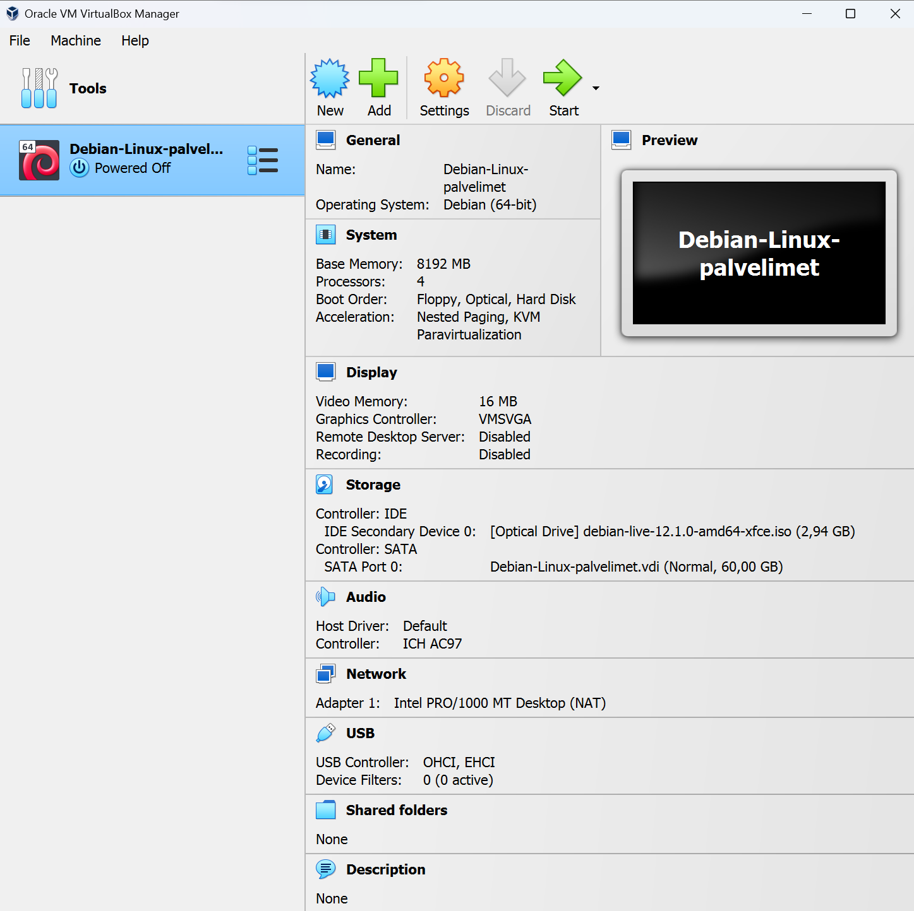
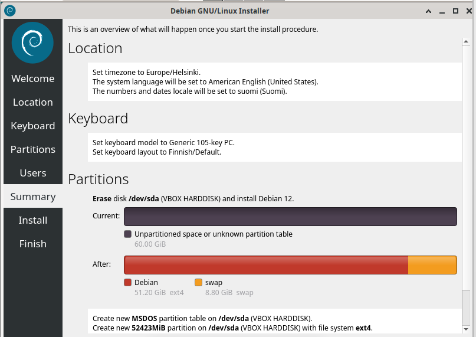
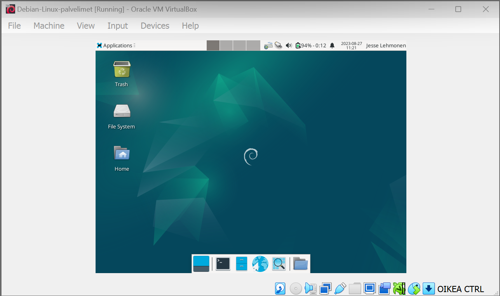
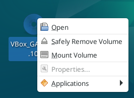
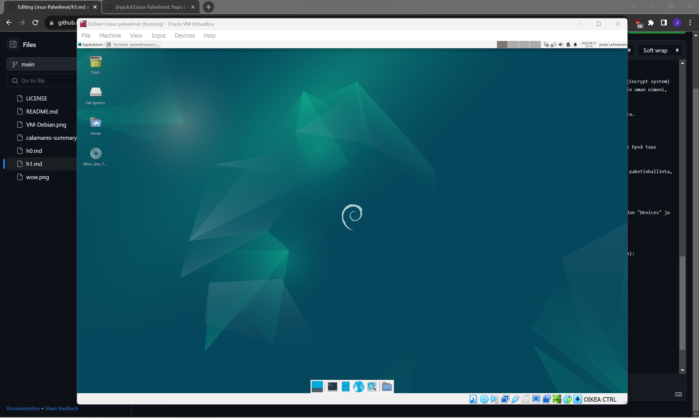

# h1 - Oma Linux

Ensimmäisen viikon kotitehtävänä tuli kirjoittaa tiivistelmä muutamalla ranskalaisella viivalla kahdesta annetusta artikkelista,
asentaa Linux virtuaalikoneeseen, sekä vapaaehtoisena bonuksena asentaa ja esitellä suosikkiohjelmani Linuxilla.
Tehtävien tarkemmat kuvaukset löytyvät opettajan [sivuilta](https://terokarvinen.com/2023/linux-palvelimet-2023-alkusyksy/).

Artikkelit joita tehtävässä tuli tiivistää, olivat kurssin opettajan, Tero Karvisen kirjoittama artikkeli [raportin kirjoittamisesta](https://terokarvinen.com/2006/raportin-kirjoittaminen-4/), sekä FSF:n (Free Software Foundation) artikkeli [vapaiden ohjelmistojen määritelmästä](https://www.gnu.org/philosophy/free-sw.html).

## x) Lukutehtävät ja tiivistäminen

### 1. Tero Karvinen, Raportin kirjoittaminen
- Raportoinnin tarkoitus on olla täsmällinen kertomus tekemästäsi.
- Täsmällisyydesä seuraa toistettavuus: mikäli annat raporttisi eteenpäin, tulisi kaiken itsellesi tapahtuneen myös tapahtua seuraavalla käyttäjällä.
- Jotta raporttia olisi helpompi myös muiden seurata, on kielen oltava selkeää ja helppolukuista.
  
### 2. FSF, FSF Free Software Definition
- Vapaan ohjelmisto ja avoimen lähdekoodin ohjelmisto tarkoittavat eri asioita, vaikkakin avoimen lähdekoodin ohjelma yleisesti ottaen onkin ilmainen.
- Sana 'Free', kääntyykin sekä vapaaksi että ilmaiseksi.
- Vapaalla ohjelmistolla halutaan korostaa yksilön oikeuksia, ja sen neljä perusvapautta ovat:
    - ohjelmaa saa käyttää mihin vain (freedom 0).
    - ohjelmaa saa tutkia ja muokata omiin tarpeisiin sopivaksi (freedom 1).
    - ohjelman kopioita saa uudelleenjakaa eteenpäin (freedom 2).
    - ohjelman muokattua versiota saa jakaa eteenpäin (freedom 3).
- FSF:n määritelmä vapaasta ohjelmistosta ei ota kantaa ohjelman hintaan. Ohjelmaa saa myydä halutulla hinnalla muille, mutta ostajalla on toisen ja kolmannen perusvapauden myötä oikeus jakaa ohjelmaa ilmaiseksi tai valitsemallaan hinnalla.

## a) Linuxin asentaminen virtuaalikoneeseen

### Käyttämäni työympäristö

Suoritin asennuksen kannettavalla tietokoneellani, Lenovo Yoga Slim 7 Pro:lla (AMD Ryzen 7 5800H @ 3.20 GHz, 16 GB DDR4-3200, NVIDIA GeForce RTX 3050 laptop 4 GB GDDR6). Kannettavan käyttöjärjestälmänä oli WIN11, versio 22H2.

Linuxin asentamiseen käytin Oraclen VM Virtual Box v7.0.10.

Asennetun Linuxin jakeluversio oli Debian 12.1 xfce työpöytäympäristöllä.

### Virtuaalikoneen asentaminen

Asentaminen alkoi lataamalla [debianin](https://cdimage.debian.org/debian-cd/current-live/amd64/iso-hybrid/) sivuilta oikea levykuva, ISO-tiedosto. Valitsin opettajan suosituksesta levykuvaksi [debian-live-12.1.0-amd64-xfce.ison](https://cdimage.debian.org/debian-cd/current-live/amd64/iso-hybrid/debian-live-12.1.0-amd64-xfce.iso). Lataamani ISO-tiedosto oli kooltaan noin 3 GB, lataamisessa ei siis suinkaan mennyt pientä happihyppelyä kauemmin.

Lataamisen jälkeen oli aika käynnistää Oraclen VM Virtual Box ja asentaa Linux käyttäen lataamaani levykuvaa.
Mainitaan tässä välissä, että asentamiseen oli tarjolla myös kattavat [ohjeet](https://terokarvinen.com/2021/install-debian-on-virtualbox/) kurssin opettajan, Tero Karvisen, kotisivuilla.
Linuxin asentaminen virtuaalikoneen nimeämisestä asennusikkunan "Name and Operating System" -kohdasta. Annoin omalleni nimeksi Debian-Linux-palvelimet. Tämän jälkeen valitsin haluamani kansion asennukselle. ISO-tiedostoksi valitsin aiemmin lataamani Debianin levykuvan. Tyyppinä sai pysyä Linux ja versioksi valikoitui Debianin 64-bittinen versio. Asennuksessa oli tärkeää poistaa täppä kohdasta "Skip Unattended Installation".

Seuraavaksi määritin laitteen ns. rautaosuutta "Hardware"- ja "Hard disk" -kohdissa. Virtuaalikoneelle annoin RAM-muistia 8 GB, 4 prosessoria sekä 60 GB dynaamista tallennustilaa. Dynaaminen tallennustila vie kovalevyltäni kuitenkin vain sen verran tilaa, mitä sinne on tallentanut tietoa, joten suurempi dynaaminen määrä tuo lisää pelivaraa. Määritysten jälkeen viimeistelin asetukset Finish-painikkeella ja Debian-Linux-palvelimet -virtuaalikone ilmestyi Virtual Boxin vasempaan reunaan. Ennen ensimmäistä käynnistystä, valitsin ylälaidasta virtuaalikoneen asetukset (Settings). Asetuksien Storage-välilehdellä lisäsin tyhjälle optiselle asemalle jo tutuksi tulleen Debianin levykuvan.

Asetusten määrittäminen oli myös muutaman minuutin työ. Lopuksi kuva luodusta virtuaalikoneesta.

### Linux Debianin asentaminen

Käynnistin Debian-Linux-palvelimet -virtuaalikoneen ja valitsin ns. bootloaderista ylimmän vaihtoehdon "Live system (amd64)". Tässä kohtaa tietokoneeni mietti noin minuutin, kunnes Debianin työpöytä aukesi eteeni. Työpöydän auettua testasin selaimella, että netti toimii - ja kyllähän se toimi.

Seuraavaksi käynnistin Debian Installerin, joka löytyi työpöydältä. Ohjelmaa käynnistäessä eteen ilmestyi varoitus, joka valitti käynnistysohjelman epäluotettavasta lähteestä. Hieman hassua, joka tapauksessa "Launch Anyway". Valinnan jälkeen ruudulle käynnistyi Linux-jakeluiden asennusohjelma Calamares.

Asennusohjelma aukesi tervetuloa-ikkunaan, jossa oletuskielenä oleva amerikan englanti sai pysyä järjestelmän kielenä. Seuraavilla sivuilla sijainniksi valikoitui Suomi ja näppäinasetuksiksi Generic 105-key PC, Finnish ja Default. Kovalevyn (Partitions) kohdalla asennusohjelma sai poistaa kaiken olemassa olevan datan (Erase disk). Salauksen (Encrypt system) täppä jäi tyhjäksi, sillä asennus suoritettiin virtuaalikoneelle. Boot loaderin sijainti täytyi myös jättää oletusarvoonsa Master Boot Recordille. Käyttäjän tietoihin annoin oman nimeni, halutun käyttäjänimeni, tietokoneen nimen (vaihdoin tässä oletuksen toasteriksi), sekä salasanan. Jätin myös täpän automaattisesta kirjautumisesta pois.

Asennusohjelman asetusten määrittäminen ei myöskään muutamaa minuuttia kauempaa vienyt. Itse asentaminen kesti noin 5 minuuttia. Kuva yhteenvedosta ennen viimeistä asennusta.

Tietokoneen uudelleen käynnistyksen jälkeen kirjauduin järjestelmään annetuilla tunnuksillani. Nyt olin saanut asennettua myös Debianin tietokoneelleni. Tässä vaiheessa oli hyvä taas testata selaimella, että kaikki toimivat. Netti, näppäimistö ja hiiri toimivat kuin pitikin.

Asennusohjeen seuraava vaihe olisi ollut komentokehotteella järjestelmän päivittäminen, mutta ohitin itse tämän vaiheen. Viikon kaksi aiheena on komentokehote, ylläpito ja paketinhallinta, joten jätin näiden tekemisen seuraavalle viikolle.

Kuten ylläoleva kuvastakin näkyy, virtuaalikoneen ruutu oli varsin pieni. Tähän löytyi alussa mainitussa asennusohjeesta ratkaisu. Valitsin virtuaalikoneen yläpalkista kohdan "Devices" ja "Insert Guest Additions CD image". Työpöydälle ilmestyi CD-levyn kuvake "VBox_GAs_7...", jonka syötin virtuaalikoneeseen hiiren oikealla kohdassa "Mount Volume".

Aiemmasta poiketen, tässä minun täytyi käyttää komentokehotetta guest additioneiden asentamiseksi. Syötin terminaaliin seuraavat komennot (ilman $-merkkiä ja lopun sulkeita):

    $ cd /media/jesse/VBox* (siirtyminen oikeaan polkuun)
    $ ls (näyttää hakemiston tiedostot ja alihakemistot)
    $ sudo bash VBoxLinuxAdditions.run (ajaa halutun asennusscriptin sudo-pääkäyttäjänä)

Komentokehote kysyi ennen asennusta vielä salasanan, jonka jälkeen asennus meni läpi mutkitta. Käynnistin Linuxin tässä kohdin uudelleen, jonka jälkeen resoluution skaalaus alkoi toimimaan.
Harjoitus vei tehokasta työaikaa arviolta tunnin, josta suurin osa painottui raportin kirjoittamiseen.

