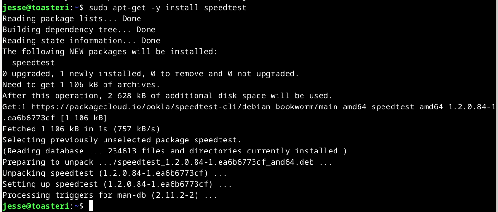
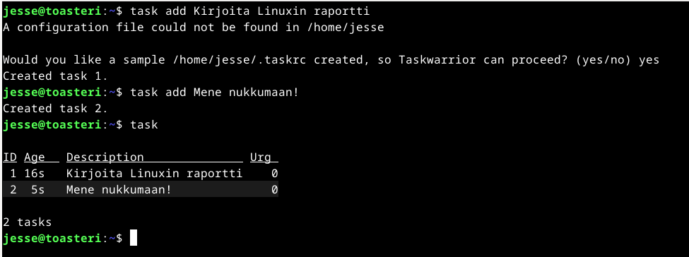

# h2 - Komentaja Pingviini

Toisen viikon tehtävät käsittelivät Linuxin komentokehotteen käyttämistä. Tehtävät koostuivat lukutehtävästä, jossa luettu artikkeli tuli jälleen tiivistää,
sekä useammasta komentokehotteella suoritettavasta tehtävänannosta. Tehtävien tarkemmat kuvaukset löytyvät opettajan [sivuilta](https://terokarvinen.com/2023/linux-palvelimet-2023-alkusyksy/).

Tiivistettävä artikkeli tämän viikon tehtävässä oli kurssin opettajan, Tero Karvisen kirjoittama artikkeli [Command Line Basics Revisited](https://terokarvinen.com/2020/command-line-basics-revisited/?fromSearch=command%20line%20basics%20revisited).

## x) Lue ja tiivistä

### Tero Karvinen, Command Line Basics Revisited

Tehtävänannossa mainittiin, että artikkelissa mainitut komennot kannattaa myös opetella ulkoa ja harjoitella automaatiotasolle.
Aloitin itse ulkoaoppimisen sisäistämällä mitä mikäkin komento tarkoittaa. Tästä syystä tiivistyksestä muodostui hieman kattavampi lista artikkelin komennoista. Lyhyenä esimerkkinä cd -> Change Directory, vaihda hakemistoa.
Mikäli komennon tarkoitus ei tahtonut selvitä, hain kyseisen komennon kohdalla lisää informaatiota internetistä.

Luettelemieni komentojen alussa olevaa $-merkkiä ei tarvitse kirjoittaa itse, dollarimerkki kuvastaa vain uutta komentoriviä tavallisena käyttäjänä.
Myös #-merkit ovat vain merkkinä alkavasta kommentista.

#### Liikkuminen ja tiedostojen lukeminen
- $ pwd #**P**rint **W**orking **D**irectory, tulostaa sen hetkisen hakemiston.
- $ ls #**L**ist file**s**, listaa hakemistossa olevat tiedostot.
- $ cd kansioesimerkki/ #**C**hange **D**irectory, vaihtaa hakemistoa. Tässä yhteydessä vaihtaisi hakemiston kansioon kansioesimerkki.
- $ cd .. #**C**hange **D**irectory .., vaihtaa hakemistoa hakemistopolussa yhtä ylöspäin.
- $ less #**Less** is more, more or less. Miksi less? Wikipedia [kertoo](https://en.wikipedia.org/wiki/Less_(Unix)) nimen syntyneen less-komennon kirjoittajan Mark Nudelmanin vitsistä.
Lessistä tuli more-komentoa kehittyneempi, sillä lessillä pystyi vierittämään tekstiä myös ylöspäin ja sivuille. Lessillä ja morella voi lukea kummallakin tekstitiedoston. Tekstitiedoston nimi syötetään komennon perään.
- $ ls /etc|less #**|**, pipe eli putki. Putkea käytetään yhdistämään kaksi eri komentoa. Mallissa on ls ja less komennot, ls listaa etc-kansion tiedostot ja less tulostaa tiedot ruudulle luettavassa muodossa.

#### Tietojen käsittely
- $ nano foo.txt #**Nano** on picon lisäksi yksinkertainen tekstieditori. Komennolla voidaan avata tai luoda uusia tekstitiedostoja syöttämällä nano-komennon jälkeen tekstitiedoston nimi.
- $ mkdir #**M**a**k**e **Dir**ectory, luo uusi kansio. Komennon perään syötetään haluttu kansionimi.
- $ mv #**M**o**v**e, siirtää tai uudelleennimeää kansion tai tiedoston. Komennon perään annetaan olemassa oleva tiedosto ja kohde. Siirrettävän tiedoston nimi muuttuu kohteeksi, oli tiedosto olemassa tai ei. Komento ei esitä varoituksia uudelleenkirjoituksesta, joten komennon kanssa tulee olla tarkkana! Mikäli tiedoston kohteena on kansio, siirtää tiedoston kohdekansioon.
- $ cp -r #**C**o**p**y ja -r, recursive, kaikkine alikansioineen. Komennon perään syötetään kopioitava ja kohde. Mikäli kyseessä on kansio, ja kaikki kansion sisällä olevat tiedot halutaan siirtää mukana kohteeseen, komentoon lisätään -r.
- $ rmdir #**R**e**m**ove **Dir**ectory, poistaa komennon perään syötetyn tyhjän kansion.
- $ rm #**R**e**m**ove, poistaa komennon perään syötetyn tiedoston.
- **Kaikki, mitä poistetaan remove-komennoilla, poistuu käytöstä pysyvästi!**

#### SSH etäyhteys
- Todennäköisesti Secure Shelliä(SSH) käsitellään myöhemmin, joten tiivistin lyhyesti SSH etäyhteyden raporttiini.
- $ ssh jesse@example.com #**S**ecure **Sh**ell, yhdistää salatun etäyhteyden käyttäjänimellä haluttuun ympäristöön.
- remotecomputer$ exit #**exit**, sulkee SSH-etäyhteyden.
- $ scp -r FOLDER jesse@example.com:public_html/ #**S**ecure **C**o**p**y, kopioi suojatusti halutin tiedoston tai kansion (kansion kanssa -r, jos kaikkine tiedostoineen). Tiedosto tai kansio kopioidaan käyttäjä@palvelinesimerkki.com hakemistoon. Hakemisto erotellaan käyttäjä@palvelinesimerkki.comista kaksoispisteellä.

#### Apuja komentoihin
- $ man #**Man**ual, näyttää oppaan komennon perään kirjoitetusta komennosta.
- Monessa komennossa on lyhyt opastus komentoihin, nämä löytyvät useimmiten syöttämällä komennon perään --help, -h tmv.

#### Komentoja adminille
- $ sudo #**S**uper**u**ser **do**, antaa teräsmiehen voimat perään annettavalle komennolle. Sudon historiasta voi lukea lisää [täältä](https://en.wikipedia.org/wiki/Sudo), itselleni riitti kuvitelma supervoimista.
Esimerkki annettavasta sudo komennosta on sudo apt-get update, mikä päivittää kaikki saatavilla olevat paketit hakemalla uusimmat päivitykset APT:sta (Advanced Package Tool).
- $ sudo apt-get -y install #Asentaa sudo-voimilla halutun ohjelman, joka on syötetty komentolauseen perään. -y vastaa asennuksen kysymyksiin Yes.
- $ sudo apt-get purge #Poistaa komennon perään syötetyn ohjelman.

## a) Micro-editorin asentaminen

### Käyttämäni työympäristö

Jatkoin harjoituksia kannettavalla tietokoneellani, Lenovo Yoga Slim 7 Pro:lla (AMD Ryzen 7 5800H @ 3.20 GHz, 16 GB DDR4-3200, NVIDIA GeForce RTX 3050 laptop 4 GB GDDR6). Kannettavan käyttöjärjestälmänä oli WIN11, versio 22H2.

Virtuaalikoneena käytin Oraclen VM Virtual Box v7.0.10.

Virtuaalikoneella pyöritettävä käyttöjärjestelmä oli Linux Debian 12.1 xfce työpöytäympäristöllä.

### Alustusta viime viikosta

Ennen varsinaista tehtävää jatkoin siitä mihin edellisessä tehtävässä h1 jäin. Viime viikon tehtävän [ohjeistuksessa](https://terokarvinen.com/2021/install-debian-on-virtualbox/) käsiteltiin komentokehoitetta päivitysten ja palomuurin asentamisella. Jätin nämä kohdat tämän viikon tehtävänantoon, jossa käsiteltiin enemmän juuri komentokehotteella suoritettavia komentoja.

Ensimmäisenä avasin komentokehotteen tietokoneellani. Viime viikon ohje sekä tällä viikolla käydyt komennot auttoivat tehtävässä, sillä ensimmäisenä tuli noutaa mahdolliset päivitykset komennolla sudo apt-get update. Komento kysyi sudo-voimiin salasanaani. Salasanan jälkeen noudossa ei kulunut kuin maksimissaan muutama sekunti.

Kun paketit oli noudettu, asensin kaiken komennolla sudo apt-get -y dist-upgrade. Komento päivitti kaiken, mihin päivitys löytyi. Asentamisessa meni noin minuutti.

Viimeisenä ennen varsinaista tehtävää oli vielä jäljellä palomuurin asentaminen ja kytkeminen päälle. Asentaminen tapahtui komennolla sudo apt-get -y install ufw. Komentojen muistamiseksi halusin alussa jo tietää komentojen merkitykset, joten tässäkin pohdin ufw:n merkitystä - jokin firewallihan se luultavasti olisi. Nopea vilkaisu Googlesta paljasti lyhenteen tulevan sanoista [Uncomplicated Firewall](https://www.linux.fi/wiki/Ufw). Asentaminen vei taas vain pari sekuntia.

Asentamisen jälkeen jäljelle jäi kytkeä palomuuri päälle. Tämä kävi yksinkertaisella komennolla sudo ufw enable.

Näiden asentamisten jälkeen käynnistin tietokoneen uudestaan ja jatkoin varsinaisen tehtävän pariin.

### Editorin asentaminen

Tehtävänä oli siis asentaa Micro-editori tietokoneelle. Editorin asentamiseksi päätin kokeilla aiemmin raportissakin mainittuja komentoja ja näiden päätelmänä päädyin komentoon sudo apt-get -y install micro. 

Miksi näin? Ensinnäkin tarvitsin asentamiseen sudon tuomia supervoimia, siksi komento alkoi sudolla. Sudon lisäksi tarvitsin komennon, joka asentaisi haluamani ohjelman. Tätä varten komennon osa apt-get -y install, jossa -y vastasi kaikkiin asennuksessa tuleviin kysymyksiin automaattisesti Yes. Viimeisenä haluamani ohjelma, micro. Syötin komennon komentokehotteeseen, joka kysyi sudon salasanaa. Syötin salasanani ja asennus lähti käyntiin. Asennuksessa kulunut aika kaikkine ajatustöineen oli muutama minuutti.

Tämän jälkeen testasin sovelluksen toimivuutta avaamalla ohjelman komentokehotteessa komennolla micro. Ohjelma aukesi ongelmitta.

## b) Rauta

Viikon kolmannessa tehtävässä tuli selvittää testaamani koneen rauta. Tietokoneeni osat sain selville komennolla sudo lshw -short -sanitize. Kuten raportissa tähänkin asti, selvitin aluksi mitä aikomani komento tarkoittaa. Tehtävänanto paljasti sen verran, että lshw on erillinen ohjelma, mikä tarvittaessa tulisi asentaa koneelle. Lshw:n arvelin kuitenkin olevan yhdistelmä ls-komennosta ja hardwaresta, short lyhyemmästä esitystavasta ja sanitizen jollain tavalla puhdistavan tietoja. Päätelmäni osuivat [aika hyvin nappiin](https://linuxhint.com/use-linux-lshw-command/). Sanitize jättää näyttämättä kaiken arkaluontoisen tiedon.

Avasin tietokoneellani komentokehotteen ja syötin aiemmin mainitun komennon sudo lshw -short -sanitize. Annoin salasanani komentokehotteen sitä kysyessä, jonka jälkeen komentokehote ilmoitti, ettei komentoa löydy.

Syötin komentokehotteella Micro-editorin asennuksestakin jo tutuksi tulleen asennuskomennon, sudo apt-get -y install lshw ja annoin sudo-voimille salasanani. Asennus pyörähti muutamassa sekunnissa läpi.

Asennuksen jälkeen suoritin komennon sudo lshw -short -sanitize uudelleen. Tällä kertaa komento meni mutkitta läpi ja lopputuloksena kuvanmukaiset tiedot:

Mitä listasta kävi ilmi? Listaus on yhteenveto tietokoneeni osista. Listaus muodostui väyläosoitteista (H/W path), laitetiedoista (Devices), laitteiden luokista (Class) sekä kuvauksesta (Description). Lisätietoa aiheesta löysin [täältä](https://www.linux.com/training-tutorials/deep-hardware-discovery-lshw-and-lsusb-linux/).

Polun alussa on tietenkin emolevy, joka tapauksessani on virtualbox. Muistia virtuaalikoneestani löytyy 8 GB ja prosessorina AMD Ryzen 7 5800H integroidulla Radeonin näytönohjaimella. Sen jälkeen listasta löytyi todennäköisesti emolevyn kaksi piirisarjaa, etelä- ja pohjoissilta. Listaus jatkui väyläosoitteiden mukaisesti eteenpäin. Komennolla löysin melko kattavan paketin tietokoneen raudasta.

## APT - kolmen itselleni uuden komentoriviohjelman asennus

### Valittujen asentaminen

Tehtävän aluksi selvitin Googlesta erilaisia TUI (Text User Interface) ja CLI (Command Line Interface) ohjelmia. Päädyin asentamaan kolme enemmän tai vähemmän hyödyllistä komentoriviohjelmaa. Ohjelmat olivat [khal](https://github.com/pimutils/khal), [Taskwarrior](https://taskwarrior.org/) ja [speedtest](https://www.speedtest.net/apps/cli). Khal on kalenteriohjelma, TaskWarriorilla voi luoda yksinkertaisia tehtävälistoja ja speedtestillä voi testata kuinka nopeasti data liikkuu tietokoneen ja verkon välillä.

Ensimmäiset kaksi ohjelmaa, khalin ja taskwarriorin, sain asennettua kerralla listaamalla molemmat ohjelmat asennuskomennon perään: sudo apt-get -y install khal taskwarrior. Satuin ensiksi kirjoittamaan komentoon TaskWarrior, mutta tuota pakettia ei löytynyt. Nimen korjaamisella asennus onnistui.

Kolmannen, speedtestin asentamisen aluksi syötin speedtestin sivuilta löytyvän komennon: curl -s https://packagecloud.io/install/repositories/ookla/speedtest-cli/script.deb.sh | sudo bash

Tämän jälkeen asennus onnistui raportissakin useamman kerran esiin tulleella asennuskomennolla.

Ohjelmien asentamisessa ei yhteensä mennyt muutamaa minuuttia kauempaa.

### Valittujen testaaminen

Ensimmäiseksi testasin kalenteriohjelmaa khalia. Ensiksi tutkin khalin --help -komennon takaa löytyviä manuaaleja. Yritin avata kalenteria khal calendar komennolla, mutta komentokehote antoi neuvokkaan virheilmoituksen.

Khalin aloittaminen alkoi siis konfiguroimalla asetukset ohjelmaan. Ohjelma kysyi mm. päivämäärän ja ajan esitystavasta.

Viimeisenä lisäsin kalenteriin uuden tapahtuman.

Toisena ohjelmana testasin taskwarriorin tehtävälistausta. Testaus alkoi taas helppi-manuaalien etsinnällä. Helpit löytyivät lopulta task help -komennolla. Taskwarriorilla listojen tekeminen ja näyttäminen lopulta oli hyvin yksinkertaista.

Viimeisenä testasin verkkoyhteyteni nopeutta speedtestillä. Kahden aiemman testauksen innoittamana kokeilin heti aluksi vain komentoa speedtest. Komento oli oikein, sillä komentokehote kysyi kahteen otteeseen hyväksynkö listatut ehdot. Vastasin molempiin kyllä, jonka jälkeen speedtest suoritti nopeustestin.

## d) FHS - Kansioiden esittely

Tehtävässä tuli esitellä [Command Line Basics Revisited](https://terokarvinen.com/2020/command-line-basics-revisited/?fromSearch=command%20line%20basics%20revisited) -artikkelin tärkeät hakemistot.

Komennot, joita etsimiseen käytin, olivat cd ja ls. Ensimmäisessä kuvassa on esimerkkinä kotihakemiston polun selaaminen, sekä siirtyminen muihin artikkelin tärkeisiin hakemistoihin.

Seuraavassa kuvassa on tiedostot mitä löysin /etc-hakemistosta.

Sekä kuva /var/log -hakemiston sisällöstä.

Mitä tärkeää hakemistosta sitten löytyi? Kaikki alkoi juurihakemistosta, mistä löytyi mm. artikkelin seuraavat tärkeät alihakemistot /home, /etc, /media ja /var/log (/log on alikansion alikansio juuritasolta katsottuna). Mitä nämä sitten olivat?

- /home pitää sisällään käyttäjien kotikansiot.
  - Esimerkkinä /home/jesse
- /etc pitää sisällään järjestelmän asetuksiin liittyviä tekstitiedostoja.
- /media pitää sisällään kaikki ulkoiset (removable) laitteet, esim USB-tikut ja CD-levyt.
- /var/log/ pitää sisällään koko systeemiin liittyvät lokitiedostot.

## e) The Friendly M

Tehtävässä tuli esittää 2-3 kuvaavaa esimerkkiä grep-komennon käytöstä. Grep (**G**lobal **R**egular **E**xpression search **P**rint) -komennolla voi tulostaa tiettyä säännöllistä lauseketta vastaavan rivin tai merkkijonon.

Otin yhden esimerkkikuvan, jossa etsin grep -R "miau" -komennolla -R -kahvaa hyödyntäen kaikkia tiedostoja, jossa ilmenisi teksti miau. -R -kahvalla grep käy jokaisen alikansionkin läpi.

Grep komentoa voisi muokata lisäämällä sinne -i -kahvan, jolloin hausta tulee merkkikokoriippumaton. Lisäksi -c -kahvan lisäyksellä näkisi montako kertaa etsitty sana esiintyy missäkin.
Grepillä pystyy myös hakemaan ns. käänteisesti. Tällöin -v -kahvaa käyttämällä haettaisiin kaikki rivit, jossa ei ole etsimäämme sanaa.

## f) Pipe

Tehtävässä tuli näyttää esimerkki | -merkin, pipen eli putken toiminnasta. Esitin raportin alussa Tero Karvisen artikkelista löytyneen putkiesimerkin. Putki siis yhdistää monta komentoa yhdelle riville. Hain esimerkissä tunnilla luodusta /Paivat/to -hakemistosta kaikki .txt -päätteiset tiedostot.

## g) Tukki

Viimeisenä tehtävänä tuli aiheuttaa lokiin kaksi eri tapahtumaa, toinen onnistuneesti ja toinen epäonnistuneesta tai kielletystä toimenpiteestä. Epäonnistuneeksi yritykseksi loin tunnillakin käydyn esimerkin, jossa syötin sudon salasanan kolme kertaa väärin. Epäonnistunut tapahtuma näkyi lokissa punaisella tekstillä. Tämän jälkeen lokissa on tallentunut kaksi onnistunutta lokitapahtumaa. Ensimmäisenä annoin sudo journalctl -komennon oikealla salasanalla, sekä viimeisenä onnistunut sudo apt-get update -komento.

## Lähteet

Tero Karvinen
- https://terokarvinen.com/2023/linux-palvelimet-2023-alkusyksy/
- https://terokarvinen.com/2020/command-line-basics-revisited/?fromSearch=command%20line%20basics%20revisited
- https://terokarvinen.com/2021/install-debian-on-virtualbox/

Wikipedia.org
- https://en.wikipedia.org/wiki/Less_(Unix)
- https://en.wikipedia.org/wiki/Sudo

Linux
- https://www.linux.fi/wiki/Ufw
- https://www.linux.com/training-tutorials/deep-hardware-discovery-lshw-and-lsusb-linux/

Linuxhint.com
- https://linuxhint.com/use-linux-lshw-command

Github
- https://github.com/pimutils/khal

Taskwarrior
- https://taskwarrior.org/

Speedtest by Ookla
- https://www.speedtest.net/apps/cli
