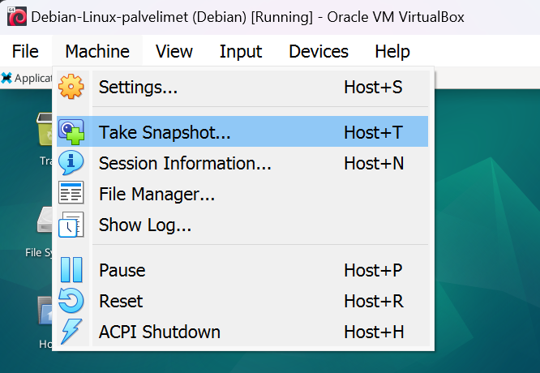
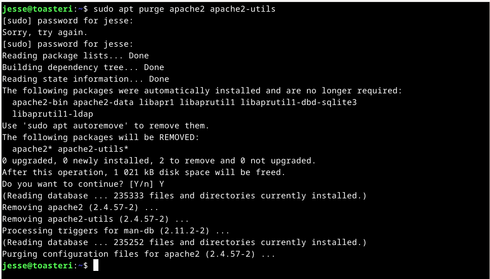
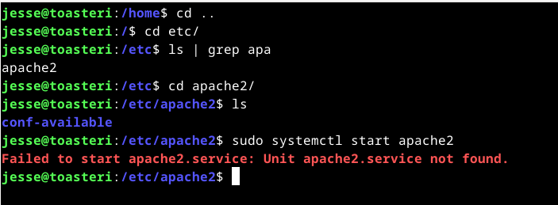
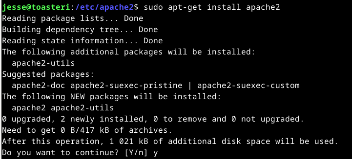
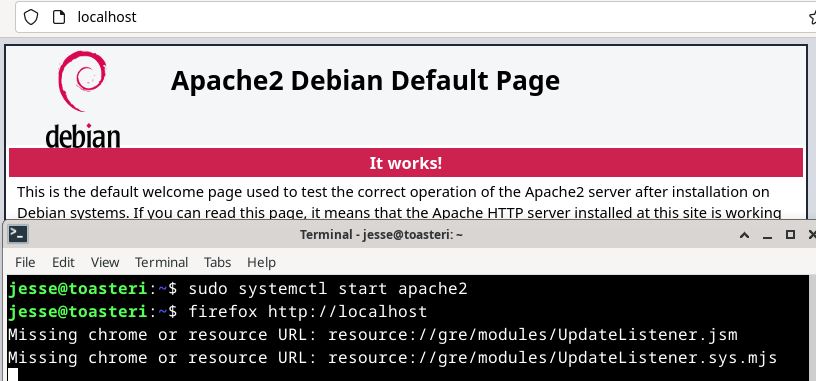

# h3 - Hello Web Server

Viikon tehtävien aiheena oli Apache-weppipalvelimen asentaminen ja siihen tutustuminen erilaisilla tehtävillä. Tehtävissä tuli lukea ja tiivistää artikkeli viikon aiheesta, käyttää komentokehotetta Apache-weppipalvelun asentamiseen ja tarkasteluun, sekä muokata weppipalvelimella olevaa kotisivua. Tehtävien tarkemmat kuvaukset löytyvät opettajan [sivuilta](https://terokarvinen.com/2023/linux-palvelimet-2023-alkusyksy/#h3-hello-web-server).

Tiivistettävä artikkeli tämän viikon tehtävässä oli kurssin opettajan, Tero Karvisen kirjoittama artikkeli [Apachen asentamisesta Ubuntulle](https://terokarvinen.com/2008/05/02/install-apache-web-server-on-ubuntu-4/).

## x) Lue ja tiivistä

### Tero Karvinen, Install Apache Web Server on Ubuntu

Ensimmäisenä huomioni kiinnittyi artikkelissa käytettyyn Linuxin jakelupakettiin (myöh. distro), Ubuntuun. Kurssilla käyttämäni distro kuitenkin on Debian. Tästä ei tarvinnut kuitenkaan kauhistua, sillä Ubuntu on rakennettu käyttäen Debianin arkkitehtuuria pohjana. Ubuntu esimerkiksi käyttää samaa APT-pakkausjärjestelmää kuin Debian, ja näin ollen jakaa hyvin paljon samoja paketteja ja kirjastoja Debianin kanssa. Toinen huomioni artikkelista oli sen ikä, mikä taidettiin mainita myös tunnilla. Ikä kertoo myös tietenkin sen, että tavat työskennellä ei kovin paljoa muutu vuosien varrella. Artikkeli on kirjoitettu vuonna 2008, ja komennot ovat silti valideja tänäkin päivänä. Näiden pohdintojen jälkeen pääsin itse tiivistelmän pariin.

#### Asennus

Apache2 weppipalvelimen asennus onnistuu komennolla:

    $ sudo apt-get install apache2

#### Testaus

Asentamisen jälkeen kannattaa testata, että kaikki toimii. Testaus tapahtuu avaamalla weppipalvelin omalla koneella, esimerkiksi avaamalla firefox-selain komennolla:

    $ firefox "http://localhost"

Oman koneeni IP-osoitteen, ja samalla osoitteen jolla ihmiset internetissä löytäisi weppipalvelimeni, saa selville komennolla:

    $ ip addr

Tätä voi myös testata firefox-selaimella, komento IP-osoitteen kanssa on:

    $ firefox "http://1.2.3.4"

Internetin nimipalvelun, eli DNS:n toimintaa voi testata komennolla:

    $ host 1.2.3.4

DNS-nimipalvelu muuntaa verkkotunnuksia IP-osoitteiksi ja päinvastoin. Päinvastoin tätä sanotaan käänteisnimipalveluksi. Jos syöttäisin verkkotunnuksen, komentokehoite näyttäisi minulle verkkotunnusta vastaavan IP-osoitteen. IP-osoitteella näkisin vastaavasti siis verkkotunnuksen.

#### Käyttäjän kotisivut

Käyttäjän kotisivujen luomiseksi kotihakemistoon on luotava public_html-hakemisto. Kaikki kansioon tallennettavat tiedostot julkistetaan internetissä. Jotta käyttäjä saa oikeuden luoda kotisivuja, täytyy userdir-niminen moduuli kytkeä päälle. Tämä tapahtuu komennolla:

    $ sudo a2enmod userdir

a2enmod tulee sanoista [Apache2 enable module](https://linuxcommandlibrary.com/man/a2enmod).

Moduulin käyttöönotto muokkaa apache2:n konfiguraatiotiedostoja /etc/apache2/-polussa. Jotta muutokset tulevat voimaan, tulee Apachen demoni (daemon, taustaohjelma) uudelleenkäynnistää komennolla:

    $ sudo systemctl restart apache2

#### Kotisivujen testaaminen

Kotisivujen testaaminen onnistuu luomalla kotihakemistoon public_html -niminen kansio. Kotihakemistoon pääsi käyttäen cd-komentoa, ja uuden hakemiston pystyi luomaan mkdir-komennolla. Kun kansio on luotu, voit tarkistaa nimesi whoami-komennolla. Lopulta voit tarkistaa kotisivusi toiminnan komennolla:

    $ firefox "http://localhost/~nimesi

## a) Apache-weppipalvelimen asentaminen

### Käyttämäni työympäristö

Jatkoin harjoituksia kannettavalla tietokoneellani, Lenovo Yoga Slim 7 Pro:lla (AMD Ryzen 7 5800H @ 3.20 GHz, 16 GB DDR4-3200, NVIDIA GeForce RTX 3050 laptop 4 GB GDDR6). Kannettavan käyttöjärjestälmänä oli WIN11, versio 22H2.

Virtuaalikoneena käytin Oraclen VM Virtual Box v7.0.10.

Virtuaalikoneella pyöritettävä käyttöjärjestelmä oli Linux Debian 12.1 xfce työpöytäympäristöllä.

$ sudo apt-get update oli suoritettu ennen tehtävien aloitusta.

### Asentaminen

Viikon tehtävät alkoivat siis Apache2-weppipalvelimen asentamisella. Tein asennuksen jo tunnilla annettujen tehtävien yhteydessä. Kertaus on kuitenkin vain plussaa, joten päädyin ensimmäisenä poistamaan Apache2:n asennuksen. Olihan kyseessä myös virtuaalinen testiympäristö, joten miksipä ei kokeilisi eri asioita.

Ennen asennuksen poistoa otin virtuaalikoneestani snapshotin, eli sen hetkisen tilannevedoksen järjestelmästä, mikäli jokin asia menisi pieleen. Snapshotin avulla voisin palauttaa järjestelmän tähän kohtaan. Snapshotin sai otettua navigointipalkin Machine-alasvetovalikosta. Snapshottaaminen kysyi vedoksen nimeä ja selitystä. Annoin vedoksen nimeksi "Snapshot 09092023" ja selitykseksi "Snapshot before deleting Apache". Nämä tiedot selventäisivät oikean vedoksen valintaa, mikäli minun tulisi palauttaa järjestelmä tiettyyn aiempaan pisteeseen.

Tilannevedoksen jälkeen jatkoin Apachen poistamista. Nopea googlaus [kertoi](https://linuxhint.com/uninstall-and-remove-apache2-on-debian/) komennon, jolla apache2 ja siihen liittyvät tiedot saisi poistettua. Komento jota käytin oli:

    $ sudo apt purge apache2 apache2-utils

Sudo-voimat tarvitsi toimiakseen taas salasanaani. Ensimmäinen salasanan syöttäminen ei onnistunut. Ilmeisesti huono ryhti pilasi tuntuman näppäimistöön, sillä asennonkorjaamisen jälkeen salasanakin meni oikein.

Tarkistin poistamisen onnistumisen ensin tarkastamalla /etc-hakemiston. Hakemistossa listasin grepin avulla kaikki apa-alkuiset hakemistot. Listaus näytti apache2-hakemiston, jonka sisältä löytyi pelkästään conf-available-kansio. Näytti vahvasti siltä, että Apachen poisto oli onnistunut. Kokeilin vielä kuitenkin käynnistää Apachen komennolla:

    $ sudo systemctl start apache2

Apachen käynnistäminen ei onnistunut, sillä palvelua ei löytynyt. Tällä varmistin poistin varmaksi. Poistaminen ja poiston tarkistaminen vei noin viisi minuuttia.

Seuraavaksi pääsinkin itse tehtävän pariin, eli juuri poistetun Apache2-webbipalvelimen asentamiseen.
Asentaminen oli poistoa huomattavasti yksinkertaisempi homma. Syötin komentokehotteeseen komennon:

    $ sudo apt-get install apache2

Komentokehote muisti aiemmin antamani salasanan, joten asennus onnistui nyt jopa huonossa ryhdissä. Jätin komennosta "-y" -valinnan pois, joten asennus kysyi haluani jatkaa. Myönteisen vastauksen jälkeen asentaminen meni hetkessä läpi.

Testasin asennuksen komennolla:

    $ sudo systemctl start apache2

Toisin kuin poiston testauksessa, tällä kertaa komento ei antanut virheitä. Varmistaakseni, että weppipalvelin oli sekä asentunut että päällä, syötin komennon:

    $ firefox http://localhost

Komento avasi selaimen tietokoneen omaan verkko-osoitteeseen, localhostiin, missä weppipalvelimen tulisi toimia. Selain aukesi Apache2:n oletussivulle, joten asennus oli varmuudella mennyt onnistuneesti läpi.

Komentokehote kuitenkin ilmoitti seuraavaa:

    Missing chrome or resource URL: resource://gre/modules/UpdateListener.jsm
    Missing chrome or resource URL: resource://gre/modules/UpdateListener.sys.mjs

Samat rivit toistuivat uudelleen, kun suljin selaimen. Aiheesta tuntui löytyvän hyvin niukasti mitään tietoa. [Reddit](https://www.reddit.com/r/Ubuntu/comments/wsnou2/missing_chrome_or_resource_url/)-keskustelun perusteella kyseessä on virheilmoitus, josta ei tarvitse välittää. Lyhykäisyydessään Firefoxissa on sisäänrakennettu päivittäjä, mutta koska päivityksiä hallinnoidaan APT-paketinhallinnan kautta, distrot kytkevät Firefoxin oman päivittäjän pois päältä. Jäljelle jää saamani virheilmoitus.

Lopputulos: asennus meni läpi ilman ongelmia. Aikaa selvitystöineen tähän kului noin 15 minuuttia.

## b) Etsi lokirivit

Asentamisen jälkeen tehtävänä oli etsiä Apachen lokista rivit, jotka syntyvät palvelimellani sivun latauksen yhteydessä. Apachen lokitiedostoja pääsin lukemaan komennolla:

    $ sudo tail /var/log/apache2/access.log

[Tail](https://www.linux.fi/wiki/Tail)-komentoa käytetään tulostamaan tiedoston viimeisiä rivejä. Omasta kiinnostuksestani selvitin myös miksi tail-komento on nimeltään tail. Vastauksena löysin [Linux-huumoria](https://www.reddit.com/r/linuxmemes/comments/oybfil/cat/?xpromo_edp=enabled).

Tail-komennon jälkeen syötin polun, josta lokitiedosto löytyi.

Rivit, jotka muodostuivat käytyäni weppipalvelimellani olivat:

    127.0.0.1 - - [09/Sep/2023:23:08:14 +0300] "GET / HTTP/1.1" 200 3380 "-" "Mozilla/5.0 (X11; Linux x86_64; rv:102.0) Gecko/20100101 Firefox/102.0"
    127.0.0.1 - - [09/Sep/2023:23:08:14 +0300] "GET /icons/openlogo-75.png HTTP/1.1" 200 6041 "http://localhost/" "Mozilla/5.0 (X11; Linux x86_64; rv:102.0) Gecko/20100101 Firefox/102.0"
    127.0.0.1 - - [09/Sep/2023:23:08:14 +0300] "GET /favicon.ico HTTP/1.1" 404 488 "http://localhost/" "Mozilla/5.0 (X11; Linux x86_64; rv:102.0) Gecko/20100101 Firefox/102.0"

Tunnistin rivien ensimmäisen puoliskon, toisesta osasta taasen jäi paljon arvailun varaan. Löysin internetistä avuksi Sumo Logicin [artikkelin](https://www.sumologic.com/blog/apache-access-log/) sekä Apachen [oman](https://httpd.apache.org/docs/2.4/logs.html) oppaan, jonka avulla onnistuin analysoimaan rivejä paremmin. Näiden lähteiden perusteella selvisi, että rivit tulostuvat ns. Combined Log Formattiin. Tyypillinen, Commong Log Format olisi esitetty ensimmäisen rivin osalta seuraavasti:

    Common Log Format:
    127.0.0.1 - - [09/Sep/2023:23:08:14 +0300] "GET / HTTP/1.1" 200 3380
    Loppuosa, josta yhdessä muodostuu Combined Log Format:
    "-" "Mozilla/5.0 (X11; Linux x86_64; rv:102.0) Gecko/20100101 Firefox/102.0"

Mitä näistä riveistä sain sitten lähteitä hyödyntäen irti? Tarkastelin raporttiini ensimmäistä weppipalvelimelle syntynyttä riviä:
- 127.0.0.1, Rivi alkaa IP-osoitteella, josta pyyntö palvelimelle lähetettiin. Tämän osasin tulkita itsekin.
- Ensimmäinen viiva ("-") lienee olevan palvelimelle pyrkivän clientin identiteetti. Tätä tietoa ei kuitenkaan yleisesti näytetä, siitä johtuen riviin tulostuu viiva. Tämä oli itselleni uusi tieto.
- Toisen viivan ("-") kohdalla olisi käyttäjäntunnus, userid, mikäli se olisi tiedossa. Myös tämä oli itselleni uusi tieto.
- [09/Sep/2023:23:08:14 +0300] näytti ajan, jolloin pyyntö tapahtui. Tämän osasin tulkita itsekin.
- "GET / HTTP/1.1", kohdassa näkyi HTTP-metodi ja HTTP-versio. HTTP:n GET-metodia käytetään yksittäisen sivun tai resurssin lukemiseen. Tämän osasin tulkita itsekin.
- 200 on statuskoodi, jonka palvelin lähetti takaisin clientille. 200 vastaa OK:ta, eli pyyntö onnistui. Tämä oli itselleni uusi tieto.
- 3380 kuvasi clientille palautuneen objektin koon tavuissa. Tämä oli itselleni uusi tieto.
- "-" näyttäisi HTTP Refererin, eli osoitteen josta kyseiselle sivulle päädyttiin. Koska menin itse suoraan localhostiin, näkyi itselläni tässä kohtaa pelkkä viiva. Tämä oli itselleni uusi tieto.
- "Mozilla/5.0 (X11; Linux x86_64; rv:102.0) Gecko/20100101 Firefox/102.0", viimeinen kohta näytti niin sanotun "User Agentin" tietoja. Apuna User Agentin tietojen purkamiseksi käytin Mozillan [developer-sivuja](https://developer.mozilla.org/en-US/docs/Web/HTTP/Headers/User-Agent). Näiden avulla selvisi seuraavaa:
    - Mozilla/5.0 on yleinen tokeni, joka ilmaisi, että selain josta pyyntö lähetettiin oli yhteensopiva Mozillan kanssa.
    - (X11; Linux x86_64; rv:102.0) ilmaisi selaimen käyttöympäristön. [X11](https://www.linux.fi/wiki/X_Window_System) on ilmeisesti standardi Unix-sukuisten järjestelmien graafiseen käyttöliittymään, Linux x86_64 viittasi Linuxin 64-bittiseen AMD:n suoritinarkkitehtuuriin ja rv:102.0 Firefoxin versionumeroon.
    - Gecko/20100101 [viittasi](https://www.linux.fi/wiki/Gecko) Mozilla-selaimen ytimeen, Geckoon. Numerosarja 20100101 sovittu merkkijono, jolla viitataan pöytätietokoneeseen (desktop computer).
    - Firefox/102.0 on valinnainen tokeni, joka ilmaisi Firefoxin versionumeron.
    - User Agent kokonaisuudessaan oli minulle uutta tietoa.

Monipuolinen analysointi tehtävä, joka laajeni yllättävänkin isoksi. Aikaa meni artikkeleiden tutkimiseen lopulta toista tuntia.

## c) Apache-esimerkkisivun vaihtaminen

## d) Käyttäjän kotisivujen luominen

## e) HTML5-sivujen luominen

## f) Esimerkkejä curl-komennoista

## m) GitHub Education - Vapaaehtoinen

## n) Nimipohjanen virtuaalipalvelu - Vapaaehtoinen

## o) Kaksi sivua, kaksi nimeä

## Lähteet

Tero Karvinen
- https://terokarvinen.com/2023/linux-palvelimet-2023-alkusyksy/
- https://terokarvinen.com/2008/05/02/install-apache-web-server-on-ubuntu-4/

Linux Command Library
- https://linuxcommandlibrary.com/man/a2enmod

Linux Hint
- https://linuxhint.com/uninstall-and-remove-apache2-on-debian/

Reddit
- https://www.reddit.com/r/Ubuntu/comments/wsnou2/missing_chrome_or_resource_url/
- https://www.reddit.com/r/linuxmemes/comments/oybfil/cat/?xpromo_edp=enabled

Linux.fi
- https://www.linux.fi/wiki/Tail
- https://www.linux.fi/wiki/X_Window_System
- https://www.linux.fi/wiki/Gecko

Apache Software Foundation
- https://httpd.apache.org/docs/2.4/logs.html

Sumo Logic
- https://www.sumologic.com/blog/apache-access-log/

Mozilla Developer Network
- https://developer.mozilla.org/en-US/docs/Web/HTTP/Headers/User-Agent
