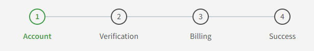
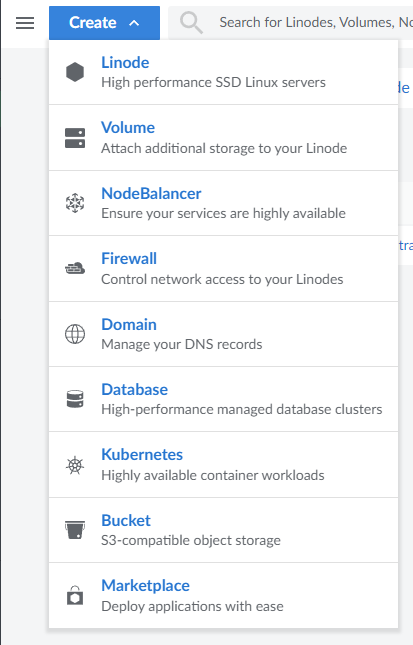
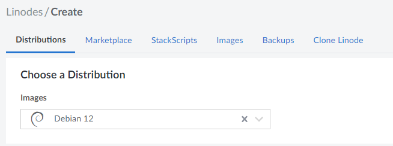
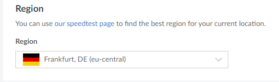
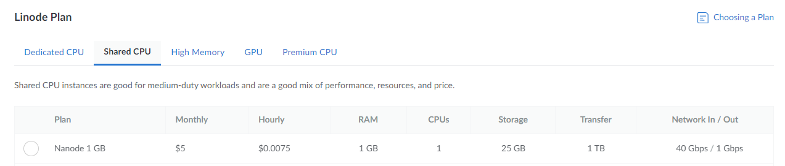
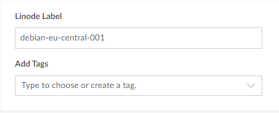
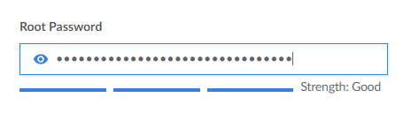
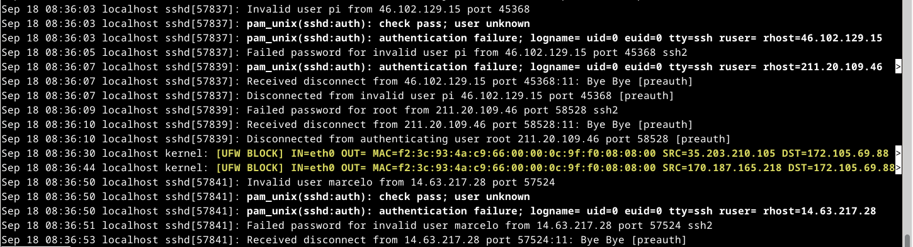

# h4 - Maailma kuulee

Neljännen viikon aiheena oli oma virtuaalinen palvelin, palveluntarjoajista aina käyttöönottoon. Tehtävän yhteydessä oli mahdollisuus myös oman virtuaalipalvelimen vuokraamiseen. Viikon aiheeseen tutustuminen alkoi taas lukemalla ja tiivistämällä artikkeli viikon aiheesta. Tehtävien tarkemmat kuvaukset löytyvät opettajan [sivuilta](https://terokarvinen.com/2023/linux-palvelimet-2023-alkusyksy/#h4-maailma-kuulee).

Tiivistettävä artikkeli tämän viikon tehtävässä oli kurssin opettajan, Tero Karvisen kirjoittama [artikkeli](https://terokarvinen.com/2017/first-steps-on-a-new-virtual-private-server-an-example-on-digitalocean/) ensimmäisistä askeleista omaa virtualipalvelinta kohti.

## x) Lue ja tiivistä

### Tero Karvinen, First Steps on a New Virtual Private Server – an Example on DigitalOcean and Ubuntu 16.04 LTS

- Siitä hetkestä lähtien, kun palvelin yhdistyy internettiin, yritetään palvelimellesi murtautua. Muista siis käyttää vaativaa salasanaa!
- Muista myös pitää tuleva järjestelmäsi päivitettynä ja ajantasalla!
- Kirjautuminen palvelimelle tapahtuu ssh-komennolla (secure shell).

		$ ssh root@palvelimen-ip-osoite #avaa secure shell -yhteyden root-pääkäyttäjänä palvelimellesi.
  
- Avaa SSH-yhteydelle portti ennen kuin kytket palomuurin päälle!

		$ sudo ufw allow 22/tcp
		$ sudo ufw enable

	- Ensimmäinen komento avaa TCP-portin numero 22. TCP (Transmission Control Protocol) on tietoliikenneprotokolla tietokoneiden väliseen luotettavaan tiedonsiirtiin. Portin numero 22 on vakiintunut portti SSH-yhteydelle.
	
- Luovu root-käyttäjästä, luo oma tunnuksesi ja siirrä käyttäjäsi ylläpitoryhmiin.

		$ sudo adduser jesse		#luo tunnuksen.
		$ sudo adduser jesse sudo	#lisää jessen sudo-ryhmään.
		$ sudo adduser jesse adm	#lisää jessen adm-ryhmään.
		$ sudo adduser jesse admin	#lisää jessen admin-ryhmään.

  - Kokeile avata uudessa komentokehotteessa SSH-yhteys lisäämälläsi tunnuksella

		$ ssh jesse@palvelimen-ip-osoite #avaa SSH-yhteyden palvelimellesi antamallasi käyttäjällä.

-	Root-pääkäyttäjä kannattaa lukita oman tunnuksen luomisen jälkeen. Root on yleinen oletustunnus, jolla yritetään ensimmäisenä murtautua palvelimellesi.

		$ sudo usermod --lock root

	- HUOM! -lock lukitsee vain salasanan, --lock lukitsee koko tunnuksen.
 - Root-pääkäyttäjällä kirjautuminen SSH:n kautta kannattaa myös poistaa käytöstä

		$ sudoedit /etc/ssh/sshd_config #muokataan sshd_config-tiedostoa, joka sisältää etäkirjautumiseen tarvittavia tietoja.
			# ...
			PermitRootLogin no	 #evää rootilta kirjautumisen.
			# ...
		$ sudo service ssh restart    #uudelleenkäynnistää ssh-yhteyden.

- Lopuksi avaa vielä palomuurista HTTP:n (selainten ja WWW-palvelinten käyttämä tiedonsiirtoprotokolla) portti numero 80.

		$ sudo ufw allow 80/tcp

## a) Virtuaalipalvelimen vuokraaminen

### Alkusanat

Olin viikon luennolla esimerkkinä, joten vuokrasin palvelimen itselleni ennen tehtävien tekoa. Virtuaalipalvelimen vuokraaminen oli kuitenkin yllättävänkin yksinkertaista. Tehtävää varten en vuokrannut itselleni uutta, vaan kävin askel askeleelta palvelimen vuokraamisen kohdat uudelleen.

### Rekisteröityminen

Kuten alussa viittasin, palveluntarjoajia löytyi internetistä useita. Tunnilla esitetyistä esimerkeistä, [Linodesta](https://www.linode.com/) ja [DigitalOceanista](https://www.digitalocean.com/), valitsin itselleni Linoden. Rekisteröityminen alkoi valitsemalla Linoden etusivulta rekisteröitymisen sähköpostilla (Email). Vaihtoehtoina olisi ollut myös Google, jota Linodekin suuresti vihreällä tyrkytti, tai GitHub. Eri tunnusten naittamista ympäri internettiä kannattaa kuitenkin tietoturvasyistä välttää.

Rekisteröityminen jatkui seuraamalla mitä ruudulle ilmestyi. Koska olin jo rekisteröitynyt, ei itseltäni löytynyt enää välivaiheista kuvia. Rekisteröityminen eteni kuitenkin hyvin selkeästi.

### Palvelimen määritykset

Tunnuksen luomisen jälkeen pääsin Linoden ohjauspaneeliin. Ohjauspaneelissa palvelimia kutsuttiin Linodeiksi, ja uuden palvelimen luominen alkoikin valitsemalla vasemmasta yläkulmasta Create -> Linode.

Palvelimen asetuksien määrittäminen oli lopulta hyvin yksinkertainen toimenpide. Määrittäminen alkoi valitsemalla ensiksi levykuva haluamastani Linux-jakelusta, distrosta. Koska kurssilla käyttämäni distro on Debian 12, oli tämä myös selkeä valinta palvelimelleni.

Seuraavaksi täytyi määritellä palvelimen sijainti. Valitsin itselleni Euroopasta Saksan Frankfurtin, ajatellen että tähtään palvelimellani Eurooppaan, ja Saksa sattui kartassa olemaan hyvin keskellä kohdeyleisöäni.

Tämän jälkeen oli ensimmäinen, ei niin selkeä valinta. Tässä määrityksessä täytyi valita palvelinta pyörittävät prosessorit. Tunnilla selvisi, että aivan turhaa maksaa tyhjästä liikaa, sillä yksinkertainen weppipalvelin pyörii varsin mainiosti Shared CPU-välilehden alta löytyvällä Nanode 1 GB -prosessorilla. Linoden [opas](https://www.linode.com/docs/products/compute/compute-instances/plans/choosing-a-plan/#dedicated-cpu-instances) neuvoi myös selkeästi oikean prosessorin valinnasta.

Palvelimen nimeen en nähnyt syitä koskea, joten jätin nimen oletusarvoon.

Seuraavaa kohtaa huomioitiin viikon artikkelissakin. Palvelimelle täytyi syöttää salasana, jonka tuli olla aikuisten oikeasti vahva.

Määritysten seuraavat kohdat olivat Linoden lisämyyntiä, joten niiden ohitettua jäljellä oli enää Create Linode. Jätin itse uuden luomisen väliin, sillä olin jo tehnyt palvelimen viikon luennolla. Uuden palvelimen käynnistyksessä kului tunnilla ehkä noin pari minuuttia luomisesta.

## b) Virtuaalipalvelimen alkutoimet

### Alustus

Olin tehnyt myös tämän tehtävän jo tunnilla oltuani esimerkkinä. Jätin tämän tehtäväosuuden kohdalla läppärini vielä sivuun, ja kirjoitin osuuden tekstimuodossa muistin ja materiaalini pohjalta.

Harjoitus tehtiin kannettavalla tietokoneellani, Lenovo Yoga Slim 7 Pro:lla (AMD Ryzen 7 5800H @ 3.20 GHz, 16 GB DDR4-3200, NVIDIA GeForce RTX 3050 laptop 4 GB GDDR6). Kannettavan käyttöjärjestälmänä oli WIN11, versio 22H2.

Virtuaalikoneena käytin Oraclen VM Virtual Box v7.0.10.

Virtuaalikoneella pyöritettävä käyttöjärjestelmä oli Linux Debian 12.1 xfce työpöytäympäristöllä.

Sekä virtuaalikoneelle että palvelimelle oli päivitetty ja asennettu uusimmat päivitykset.

### Tehtävä

Nyt olin vasta saanut vuokrattua itselleni virtuaalipalvelimen. Virtuaalipalvelimella oli vielä kuitenkin paljon tekemistä, joten aloitin työskentelyn tehtävänannon mukaisilla alkutoimilla. Aluksi tuli kirjautua SSH-yhteydellä palvelimelleni. Tämä kävi artikkelin neuvoin komennolla:

	$ ssh root@palvelimeni-ip-osoite #IP-osoite löytyi Linoden hallintapaneelista
 	Syötä palvelimen yhteydessä luotu vahva salasana

Komennolla yhdistin itseni virtuaalipalvelimelleni. Virtuaalipalvelimella ensimmäisenä aloitin palomuurin kytkemisen päälle. Mikäli palomuuria ei tässä vaiheessa ollut vielä palvelimella asennettuna, tuli se asentaa apt-get install ufw -komennolla. Palomuurin kytkeminen päälle alkoi avaamalla SSH-yhteyden portti numero 22. Mikäli tätä porttia ei avaisi, palomuuri estäisi jatkossa SSH-yhteyden muodostamisen. Portin avaaminen ja palomuurin kytkeminen päälle onnistuivat seuraavilla komennoilla:

	$ sudo ufw allow 22/tcp
 	$ sudo ufw enable

 - Palomuurin statuksen pystyi tässä kohdin tarkistaa komennolla $ sudo ufw status.

Kun palomuuri oli päällä, seuraava vaihe oli luoda itselleni sudo-tunnus ja lukita oletuksena toimiva root-tunnus. Oman tunnuksen luominen ja lisääminen sudo-ryhmään tapahtui seuraavilla komennoilla:

	$ sudo adduser jesse
 	$ sudo adduser jesse sudo
  
 - Käyttäjän salasanaksi täytyy tässäkin antaa erittäin vahva salasana!

Ennen kuin pystyin lukitsemaan root-tunnuksen, tuli tarkistaa olinko onnistunut lisäämään itseni sudo-ryhmään. Avasin uuden komentokehotteen, jolla yritin kirjautua palvelimelleni komennolla:

	$ ssh jesse@palvelimeni-ip-osoite

Pääsin myös omalla tunnuksellani kirjautumaan palvelimelleni. Testasin omat sudo-voimani sudo echo moi -komennolla. Komentokehote vastasi moi, joten olin saanut sudovoimat onnistuneesti. Jatkoin työskentelyä oman tunnukseni komentokehotteessa, ja suljin rootin yhteyden kirjoittamalla komentokehotteeseen exit. Jatkoin jessenä root-tunnuksen lukitsemista. Lukitseminen kävi artikkelista löytyvällä komennolla:

 	$ sudo usermod --lock root

Tämän vaiheen toteutin myöhemmin kotona. Kytkin root-tunnuksen SSH-kirjautumisen pois päältä seuraavilla komennoilla ja tiedostorivin muokkaamisella: 

	$ sudoedit /etc/ssh/sshd_config
   	 # ...
	 PermitRootLogin no
   	 # ...
	$ sudo service ssh restart

 - Yritin kirjautua uudessa komentokehotteessa root-tunnuksella palvelimelleni. Vastauksena Permission denied, please try again.

Viimeisenä ennen weppipalvelimen asennusta tuli vielä avata palomuurista HTTP:n (selainten ja WWW-palvelinten käyttämä tiedonsiirtoprotokolla) portti numero 80. Tämä kävi komennolla:

	$ sudo ufw allow 80/tcp 

## c) Weppipalvelin virtuaalipalvelimelle

Kuten aiemmassakin tehtävässä, suoritin tehtävän jo tunnilla ja raporttia kirjoittaessa kannettava tietokoneeni oli vielä sivussa. Tämäkin tehtävä raportoitiin tekstimuodossa.
Tehtävä alkoi asentamalla Apache2-weppipalvelin virtuaalipalvelimelleni ja varmistamalla että weppipalvelin käynnistyy. Nämä kävi yksinkertaisesti komennoilla:

	$ sudo apt-get install apache2
 	$ sudo systemctl start apache2

Avasin selaimella palvelimeni IP-osoitteen, mistä aukesikin apachen oletussivu. Weppipalvelimeni oli internetissä ja toimi! Muokkasin vielä yksinkertaisesti oletussivun komennolla:

	$ echo wadap|sudo tee /var/www/html/index.html

Komento pyyhki oletussivun html-koodin puhtaaksi, ja lisäsi sinne vain tekstin wadap. En aikataulultani ehtinyt vielä tekemään validia HTML5-sivua palvelimelleni, joten toistaiseksi [sivu](http://172.105.69.88) tervehtii kävijäänsä hyvin yksinkertaisesti niin tietokoneella kuin mobiililaitteellakin.

## d) Murtautumisyrityksiä?

Selvitin murtautumisyrityksiä antamalla palvelimeni komentokehotteessa komennon:

	$ sudo journalctl -n 2000

Murtautumisyrityksiä oli paljon. Palvelin oli ehtinyt olemaan vajaan viikon ylhäällä, ja loki näytti murtautumisia tapahtuvan muutaman minuutissa. Nopeasti päässä laskettuna lopullinen määrä oli siis aika monta.

Lokien analysointi jäi harmillisesti kiireiden takia syvemmin perehtymättä. Nopealla vilkaisulla lokeista käy kuitenkin ilmi seuraavia:
- Murtautumisen ajankohta,
- Lokimerkintöjä (esim. invalid user marcelo)
- IP-osoite, josta yritetty kirjautua.
- Palomuurin portin numero

Vaikuttaisi myös, että yritykset ovat olleet ns. Brute Forcea, jossa rootin nimeä ja salasanaa yritetään vain saada arvattua oikein.

## Lähteet

Tero Karvinen
- https://terokarvinen.com/2023/linux-palvelimet-2023-alkusyksy/#h4-maailma-kuulee
- https://terokarvinen.com/2017/first-steps-on-a-new-virtual-private-server-an-example-on-digitalocean/

DigitalOcean
- https://www.digitalocean.com/

Linode
- https://www.linode.com/
- https://www.linode.com/docs/products/compute/compute-instances/plans/choosing-a-plan/#dedicated-cpu-instances
