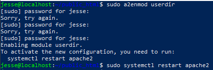

# h5 - Nimittäin

Viidennellä viikolla tehtävät keskittyivät verkkotunnukseen eli domainiin. Tehtävien yhteydessä oli mahdollisuus myös vuokrata omalle weppipalvelimelle domain-nimi, käyttämällä esimerkiksi [GitHub Educationin](https://education.github.com/) ilmaisia domain-nimiä. Domain-nimen vuokraaminen onnistui myös tuotantoonkin kelpaavilta palveluntarjoajilta, esimerkiksi [NameCheapiltä](https://www.namecheap.com/). Tehtävien tarkemmat kuvaukset löytyvät opettajan [sivuilta](https://terokarvinen.com/2023/linux-palvelimet-2023-alkusyksy/#h5-nimittain).

Tämän viikon lukutehtävien artikkelit olivat kurssin opettajan, Tero Karvisen kirjoittamat artikkelit [New Default Website with Apache2](https://terokarvinen.com/2016/02/16/new-default-website-with-apache2-show-your-homepage-at-top-of-example-com-no-tilde/) ja [Name Based Virtual Hosts on Apache](https://terokarvinen.com/2018/04/10/name-based-virtual-hosts-on-apache-multiple-websites-to-single-ip-address/) sekä Apache Software Foundationin dokumentti [Name-based Virtual Host Support](https://httpd.apache.org/docs/2.4/vhosts/name-based.html).

## x) Lue ja tiivistä

### Tero Karvinen, New Default Website with Apache2 – Show your homepage at top of example.com, no tilde

- Artikkelin opasta seuratakseen, edellisten viikkojen opit ovat tarpeen. Ilman perustietämystä artikkelin opastusta voi olla hankala toteuttaa.
- Apachessa VirtualHost (virtuaalipalvelin) vastaa lähes samaa kuin verkkosivusto. Yksittäinen Apache-palvelin voi pitää sisällään useammankin virtuaalipalvelimen.
  - Jokainen virtuaalipalvelin on määritetty yhdelle conf-tiedostolle /etc/apache2/sites-available/ -hakemistossa.
  - Jokaisella saatavilla olevalla virtuaalipalvelimella on symlinkki (symbolinen linkki, jolla [viitataan](https://www.linux.fi/wiki/Symbolinen_linkki) toisaalle) /etc/apache2/sites-enabled/ -hakemistoon.
    - Virtuaalipalvelimen ottaminen käyttöön käy komennolla ``$ sudo a2ensite sivu.conf`` (apache2 enable site).
    - Virtuaalipalvelimen ottaminen pois käytöstä komennolla ``$ sudo a2dissite sivu.conf`` (apache2 disable site).
      - _Materiaalissa ``a2dismod`` (disable module), myöhemmin oppaassa kuitenkin ``a2dissite``._
- Uuden virtuaalipalvelimen voi luoda luomalla uuden conf-tiedoston /etc/apache2/sites-available/ -hakemistoon. Tiedostonimessä ei saa olla erikoismerkkejä.
  - Virtuaalipalvelimen conf-tiedostoa muokataan artikkelin mallin mukaisesti:
  
 		## /etc/apache2/sites-enabled/sivu.conf
		<VirtualHost *:80>
		DocumentRoot /home/jesse/public_html/
		<Directory /home/jesse/public_html/>
 		Require all granted
		</Directory>
		</VirtualHost>

    - Virtuaalipalvelin kuuntelee porttia 80 (HTTP-protokolla).
    - Lisätään DocumentRoot. DocumentRoot on polku hakemistolle, mikä sisältää kaikki sivustosi html-tiedostot.
    - Annetaan Apachelle lupa käyttää kyseisen hakemiston tiedostoja.
- Vanhan virtuaalipalvelimen (oletussivun) symlinkin voi ottaa pois käytöstä, kun uusi virtuaalipalvelin on valmis otettavaksi käyttöön.
	- Uudelle virtuaalipalvelimelle on syytä luoda kotisivut ennen käyttöönottoa. Tällöin välttää virheilmoitukset sivustolla vieraillessa.

### Tero Karvinen, Name Based Virtual Hosts on Apache – Multiple Websites to Single IP Address

- Moni artikkelin asia oli toistoa ensimmäisestä.
- Apachella voi pitää useampia domain-nimiä yhdellä IP-osoitteella.
- Testaaminen onnistuu esimerkiksi seuraamalla artikkelin vaiheita.
  - Muokataan Apachen oletussivua.
  - Luodaan ja otetaan käyttöön uusi virtuaalipalvelin (kohtia avattu edellisen artikkelin kohdalla).
  - Luodaan uusi html-tiedosto virtuaalipalvelimen DocumentRoot-hakemistoon.
  - Testataan esimerkiksi curl-komennoilla tai avaamalla selaimessa localhost ja juuri luotu html-sivu.
    - Tuotantoympäristössä käytössä olisi oikeita domaineja. Näitä voi simuloida lisäämällä palvelimia /etc/hosts/ -tiedostoon.

### Apache Software Foundation, Name-based Virtual Host Support

#### Name-based vs IP-based Virtual Hosts

- IP-pohjaiset virtuaalipalvelimet käyttävät nimensä mukaisesti IP-osoitetta oikean virtuaalipalvelimen määrittämiseksi ja siksi tarvitsevat jokaiselle erilliselle palvelimelle oman IP-osoitteen.
- Nimipohjaiset virtuaalipalvelimet käyttävät HTTP-protokollan otsikkotietoja (headers) palvelimen tunnistamiseksi. Tällöin IP-osoitteessa voi olla useampi eri palvelin.
- Nimipohjaisessa virtuaalipalvelimessa määritellyt palvelinnimet osoitetaan tiettyyn IP-osoitteeseen. Apache ohjaa käyttäjän oikealle sivulle.
  - Jotta Apache ohjaisi minnekkään, täytyy virtuaalipalvelimeen olla määritetty vähintään ServerName ja DocumentRoot
  - Jos palvelinnimiä on useampi samalla IP-osoitteella, Apache etsii ensin IP-osoitteella ja portilla määritettyä virtuaalipalvelinta.
    - Asteriski (*) virtuaalipalvelimen IP-osoitteessa tekee IP-kartoituksen merkityksettömäksi.
  - Mikäli IP-kartoituksella ei löydy vastausta, Apache etsii parhaimman vastaavuuden vertailemalla ServerNamea ja ServerAliasta.
- Paras käytäntö on aina nimetä virtuaalipalvelin (määritellä ServerName).
- ServerAlias on virtuaalipalvelimen alias-nimi, jolla käyttäjä pääsee näkemään sivun.

## a) Domain-nimen vuokraaminen

### Alustus

Olin tunnilla esimerkkinä ollessani ehtinyt jo vuokrata domain-nimen itselleni NameCheapiltä. Tehtävää tehdessä minulla siis oli jo nimi, enkä toista nimeä aikonut tässä vaiheessa hommata. Pyrin kuitenkin käymään kohdat muistin ja materiaalin pohjalta läpi.

## Domainin vuokraaminen

Ensimmäisenä rekisteröidyin valitsemalleni palveluntarjoajalle, namecheapiin. Rekisteröityäni ja kirjauduttuani palveluun, syötin namecheapin kojelaudalla (dashboard) olevaan hakukenttään tulevan domain-nimeni. Haettuani haluamani nimen, namecheap listasi kuvan mukaisesti kaikki tarjolla olevat domain-päätteet. 

Sivu jatkui kuvasta vielä alaspäin, mistä löytyi huomattavasti edullisempia vaihtoehtoja, esimerkiksi .site, joka maksoi reilu 90 snt / vuosi. Valittuani haluamani domainin ostoskoriin, siirryin eteenpäin alakulmaan ilmestyneestä Checkout-painikkeesta. Koska kyseessä oli vain testisivusto, auto-renew kannatti valita pois. Mikäli sivusto tulisi olemaan pitkän aikavälin suunnitelma, auto-renewiä voisi harkita. Tällöin en tulisi välttämättä menettämään domainnimeäni niin helposti. Domain Privacy sai jäädä, sillä valinta ei maksa mitään, eikä ylimääräinen yksityisyyden suoja ole haitaksikaan. Muuten kaikki tarjottu "tilpehööri" sivuutettiin. Enää tarvitsi vain viimeistellä ostos.

Ostoksen jälkeen namecheapin kojelaudalta löytyi ikioma domain-nimeni. Tälle täytyi määrittää weppipalvelimeni IP-osoite, jotta nimi tulisi yhdistämään ylipäänsä minnekään. Valitsin oikeasta reunasta Manage, joka johdatti minut domain-nimeni asetuksiin. Asetuksissa tuli valita Advanced DNS.

Advanced DNS -välilehdellä lisäsin kaksi uutta recordia (tallennetta?), www ja @. Molemmille tallenteille annoin weppipalvelimeni IP-osoitteen ja määritin kummallekin TTL-ajaksi (Time to Live) yhden minuutin.

Tämän jälkeen oli aika odottaa DNS-palvelinten päivittymistä. Kun DNS-palvelimet olivat päivittyneet, lolleropyllero.online -verkkosivu toimi osoitteenkin avulla.

## b) Nimen tutkiminen

### Alustus

Harjoitus tehtiin pöytäkoneellani (Intel i7-7700K @ 4.20GHz, 16 GB DDR4-2666, NVIDIA GeForce GTX 1070 8 GB GDDR). Tietokoneen käyttöjärjestälmänä oli WIN10 Home, versio 22H2.

Otin yhteyden weppipalvelimeeni Windowsin PowerShellillä. PowerShellin versio oli 5.1.19041.3031

Palvelimelle oli päivitetty ja asennettu uusimmat päivitykset ennen tehtävien aloittamista.

### Nimen tutkiminen

Aloitin tutkimisen kirjoittamalla PowerShelliin komennot ``host lolleropyllero.online`` ja ``dig lolleropyllero.online``.

Host-komennolla voidaan tehdä kyselyjä nimipalvelimelle. Nimen avulla saadaan IP-osoite selville ja päinvastoin. Hain itse host-komennolla vastausta nimellä, joten vastauksena tuli nimeä vastaava IP-osoite: ``lolleropyllero.online has address 172.105.69.88``. Seuraavat rivit kertoivat sähköpostipalvelinten osoitteita. 
Esimerkiksi ensimmäinen rivi ``lolleropyllero.online mail is handled by 10 eforward1.registrar-servers.com.`` on ns. [MX-record (Mail Exchanger record)](https://workaround.org/ispmail/wheezy/dns-make-your-mail-server-known-on-the-internet), joka muodostuu seuraavista osista:
- ``lolleropyllero.online mail is handled by`` palvelin, johon sähköpostipalvelimet
- ``10`` prioriteettiluku, joka määrää mitä sähköpostipalvelinta käytetään
- ``eforward1.registrar-servers.com`` sähköpostipalvelimen osoite.

[Dig-komennolla](https://www.geeksforgeeks.org/dig-command-in-linux-with-examples/) (Domain Information Groper) saadaan tietoja DNS-nimipalvelimista. Komentoa käytetään hyvin paljon esimerkiksi DNS-vianetsintään. Mitä oman komentoni vastauksesta kävi siis ilmi? Käytin apuna löytämääni [artikkelia](https://ns1.com/blog/decoding-dig-output), sekä digin manuaalia ``man dig``.

	; <<>> DiG 9.18.19-1~deb12u1-Debian <<>> lolleropyllero.online
	;; global options: +cmd
	;; Got answer:
	;; ->>HEADER<<- opcode: QUERY, status: NOERROR, id: 15966
	;; flags: qr rd ra; QUERY: 1, ANSWER: 1, AUTHORITY: 0, ADDITIONAL: 1
	
	;; OPT PSEUDOSECTION:
	; EDNS: version: 0, flags:; udp: 1232
	;; QUESTION SECTION:
	;lolleropyllero.online.         IN      A
	
	;; ANSWER SECTION:
	lolleropyllero.online.  60      IN      A       172.105.69.88
	
	;; Query time: 8 msec
	;; SERVER: 139.162.133.5#53(139.162.133.5) (UDP)
	;; WHEN: Mon Sep 25 07:30:27 UTC 2023
	;; MSG SIZE  rcvd: 66

- ``; <<>> DiG 9.18.19-1~deb12u1-Debian <<>> lolleropyllero.online`` Versionumero ja annettu haku, lolleropyllero.online
- ``;; global options: +cmd`` Lisäasetuksia, tarkkaa varmuutta ei ole.
- ``;; Got answer:`` Vastauksen alkuosa.
- ``;; ->>HEADER<<- opcode: QUERY, status: NOERROR, id: 15966`` Ei virheitä, muusta ei niin tietoa.
- ``;; flags: qr rd ra; QUERY: 1, ANSWER: 1, AUTHORITY: 0, ADDITIONAL: 1`` Flags, eli liput ovat valintoja joilla määritellään esimerkiksi mitä tulostetaan.
  - qr = kysely, rd = rekursiivinen kysely, ra = vastaus saatavilla
- ``OPT PSEUDOSECTION`` Jonkinsortin DNS-laajennusosio, ja sen tiedot.
- ``ANSWER SECTION``, Palvelimen vastaukseen liittyviä tietoja, mm. kyselyyn käytetty aika, palvelimen osoite ja käytetty protokolla, aikaleima ja vastauksen koko tavuina.
- ``;; Query time: 8 msec`` Kyselyyn käytetty aika.
- ``;; SERVER: 139.162.133.5#53(139.162.133.5) (UDP)`` Palvelimen osoite ja käytetty protokolla.
- ``;; WHEN: Sun Sep 24 20:51:19 UTC 2023`` Kyselyn aikaleima.
- ``;; MSG SIZE  rcvd: 66`` Vastauksen koko tavuina.
  
## c) Etusivu uusiksi

Aloitin tehtävän antamalla ensiksi käyttäjille luvan luoda kotisivuja komennolla ``sudo a2enmod userdir``, jonka jälkeen käynnistin Apachen uudelleen.

Seuraavaksi loin itselleni ensiksi /home/jesse/-hakemistoon itselleni public_html-kansion, minkä alle loin index.html-tiedoston.

Tämän jälkeen lisäsin uuden virtuaalipalvelimen komennolla ``$ sudoedit /etc/apache2/sites-available/jesse.conf``, mihin lisäsin artikkelin esimerkin mukaan tietoa.
Seuraavaksi otin luomani jesse.conf virtuaalipalvelimen käyttöön ``$ sudo a2ensite jesse.conf``-komennolla, jonka jälkeen apache täytyi päivittää tarjotulla reload-komennolla.
Otin myös vanhan 000-default.conf virtuaalipalvelimen pois vastaavasti ``a2dissite``-komentoa käyttäen. 

Tässä kohdin selaimeni ilmoitti Forbidden-virhettä, kun yritin yhdistää sivulleni. Lisäsin ``sudo chmod ugo+x $HOME $HOME/public_html/``-komennolla oikeat oikeudet kansiolleni.

Tämän jälkeen lolleropyllero.onlinen [etusivulla](http://lolleropyllero.online/) näkyi omassa kotihakemistossa oleva html-sivu.

## Lähteet

Tero Karvinen
- 

GitHub Education
- https://education.github.com/

NameCheap
- https://www.namecheap.com/

Linux.fi
- https://www.linux.fi/wiki/Symbolinen_linkki

Workaround.org
- https://workaround.org/ispmail/wheezy/dns-make-your-mail-server-known-on-the-internet

Geeksforgeeks
- https://www.geeksforgeeks.org/dig-command-in-linux-with-examples/

NS1
- https://ns1.com/blog/decoding-dig-output
