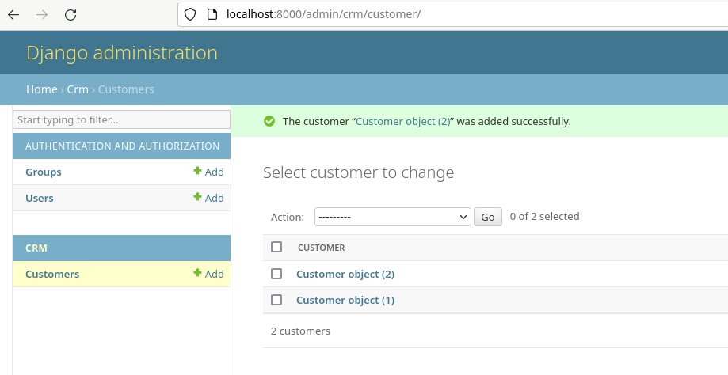

*Tehtävää on jatkettu palautuksen jälkeen. Jatketut työvaiheet löytyvät raportin lopusta*

# h6 - DJ Ango

Viikon tehtävissä tutustuin Djangoon erilaisten tehtävänantojen kautta. Django on Python-pohjainen sovelluskehys, jota käytetään muun muassa weppisovellusten tekemiseen. Viikon tehtävinä tuli lukea ja tiivistää annetut artikkelit, asentaa Djangon kehitysympäristö ja luoda esimerkkitietokanta, sekä lopulta luoda tuotantotyyppinen asennus omalla virtuaalikoneella pyörivälle Apachelle. Tehtävien tarkemmat kuvaukset löytyvät opettajan [sivuilta](https://terokarvinen.com/2023/linux-palvelimet-2023-alkusyksy/#h6-dj-ango).

Artikkelit, jotka tämän viikon tehtäviin tuli lukea ja tiivistää olivat kaikki kurssin opettajan, Tero Karvisen kirjoittamia. Artikkelit olivat Python-kurssin [osaamistavoitteiden tekniikat](https://terokarvinen.com/2023/python-web-idea-to-production/#osaamistavoitteet), [asiakastietokannan teko-opas](https://terokarvinen.com/2022/django-instant-crm-tutorial/) ja kuinka Djangoa [hyödyntää oikeassa tuotantoympäristössä](https://terokarvinen.com/2022/deploy-django/).

## x) Lue ja tiivistä

### Tero Karvinen, Python Web - Idea to Production - 2023

Weppisovelluksen kehittämisen puolesta puhuu kaikki viisi luetelmamerkkiä.

- Ensiksi weppisovellusta ei tarvitse luoda millekään muulle kuin selaimelle.
  - Selainpohjaisena sovellus toimii eri laitteiden eri selaimissa.
  - Sovellusta kehittäessä tarvitsee vain kehittää yhtä ohjelmaa
- Toiseksi weppisovellus kerää itsessään paljon tietoa palvelun käytöstä.
  - Tietoa kerääntyy Apachen omiin tietolokeihin.
- Kolmanneksi weppisovellus mahdollistaa monien käyttäjien yhtäaikaisen tietojen muokkaamisen.
- Neljänneksi weppisovellus toimii ilman erillisiä ohjelman asennuksia. 
  - Sovellus on heti käyttäjän saatavilla.
  - Tietoturvallisempi vaihtoehto ilman ladattavaa ohjelmaa.
- Viimeiseksi käyttäjällä on aina uusin versio käytössään.
  - Weppisovelluksessa on aina julkaistuna uusin versio.
  - Eri versioiden aiheuttamat ristiriidat ovat historiaa.

### Tero Karvinen, Django 4 Instant Customer Database Tutorial

Artikkelin oppaan avulla voi luoda yksinkertaisen asiakastietokannan web-käyttöliittymällä käyttäen Djangoa. Opasta seuratakseen Linuxin komentokehote tulisi olla tuttu.

#### Kehitysympäristön asentaminen

- Asenna Pythonin kehitysympäristö komennolla ``$ sudo apt-get -y install virtualenv``.
- Uuden kehitysympäristön luominen ajankohtaisilla Pythonin paketeilla käy komennolla ``$ virtualenv --system-site-packages -p python3 env/``.
  - Komento luo /env -kansion, joka pitää sisällään viimeisimmät paketit löytyvät lib/site-packages/-hakemistosta.
  - ``--system-site-packages`` sallii ulkopuolisten pakettien käyttämisen virtualenvin kehitysympäristössä.
- Kehitysympäristön käyttö aloitetaan komennolla ``$ source env/bin/activate``.
  - Kehitysympäristö ei ole tietoturvaominaisuus tai hiekkalaatikko, vaikka nimen virtuaalisuus niin antaisi olettaa.
  - Python-paketit tulee asentaa harkiten ohjelmakohtaisesti.
- Python package manageria (pip, package installer for python) tulee käyttää vain kehitysympäristössä **ilman** sudo-voimia.
  - ``$ which pip``-komennolla voi tarkistaa pip:n polun.
- Django-paketit lisätään kehitysympäristössä ``requirements.txt``-tiedostoon.
- ``$ pip install -r requirements.txt`` asentaa listaan kirjatut paketit
  - ``$ django-admin --version``-komennolla voi tarkistaa asennuksen onnistumisen.

#### Django-projektin käynnistäminen

- Koko verkkosivusto on projekti Djangossa.
- Projekti aloitetaan komennolla ``$ django-admin startproject project-j``.
- Testipalvelimen käynnistys tapahtuu luodun projektin hakemistossa ``./manage.py runserver``-komennolla.
  - Testipalvelin, ei saa altistaa internetille!
- Testaus onnistuu localhostin 127.0.0.1:8000 -osoitteessa.

#### Admin on ilmainen

- Admin-paneeli löytyy 127.0.0.1:8000/admin -osoitteesta.
- Kirjautuakseen admin-paneeliin, tulee tietokanta päivittää ja lisätä vähintään yksi järjestelmänvalvoja.
  - ``$ ./manage.py makemigrations`` ja ``$ ./manage.py migrate`` tuo ja päivittää tehdyt muutokset.
  - ``$ ./manage.py createsuperuser`` voi luoda uuden järjestelmänvalvojan.
    - Asentamalla pwgenin (password generator) saa generoitua vahvoja salasanoja.

#### Asiakastietokanta - CRM

- ``$ ./manage.py startapp crm`` -komento luo uuden kansion weppisovellukselle.
- ``settings.py`` -tiedoston INSTALLED_APPS-listaan lisätään 'crm' -rivi.
- Django luo automaattisesti malleista tietokantoja, käyttöliittymiä ja lomakkeita.
- Uuden mallin lisääminen tapahtuu muokkaamalla crm-hakemistossa olevaa ``models.py``-tiedostoa:

  -     from django.db import models
        
        class Customer(models.Model):   # uusi Customer-luokka
          name = models.CharField(max_length=300)  # Customer-luokasta löytyy nyt name-muuttuja

        def __str__(self):    # nämä kaksi viimeistä riviä muuttavat muuttujan merkkijonoksi
        return self.name    # admin-paneelissa näkyy siis asiakkaan nimi objektien sijaan

- Tietokantamuutokset tulee päivittää raportissa aiemmin esitetyillä komennoilla.
- Jotta uusi tietokanta näkyisi admin-paneelissa, tietokanta tulee rekisteröidä crm-hakemiston ``admin.py``-tiedostoa.

  -     from django.contrib import admin
        from . import models

        admin.site.register(models.Customer)

- Toimivuuden voi testata kirjautumalla adminin sivuille. Weppisovellus toimii oikein, mikäli CRUD-toiminnot (create, read, update, delete) toimivat.

### Tero Karvinen, Deploy Django 4 - Production Install

Djangolla voi kirjoittaa helposti weppisovelluksia. Oppaan avulla sovelluksen voi julkaista internetissä käyttäen Apache2:sta ja mod_wsgi:tä. [Mod_wsgi](https://en.wikipedia.org/wiki/Mod_wsgi) on Apache HTTP Server -moduuli, joka tarjoaa WSGI- (Web Server Gateway Interface) yhteensopivan käyttöliittymän Python-pohjaisille weppisovelluksille.

#### Apache2 aluksi

- Aluksi asennetaan Apache2 ja halutessaan muokataan Apachen oletussivua ``$ echo "Näkyillään project-j.comissa"|sudo tee /var/www/html/index.html``.
  - Testejä kannattaa suorittaa useasti, tässäkin kohtaa voi tarkistaa muutosten astumisen voimaan avaamalla selaimessa localhost.
- Kotihakemistoon luodaan tarvittavat kansiot ja tiedostot uudelle weppisivulle aiempien viikkojen oppien mukaisesti.

  -     $ cd
        $ mkdir -p publicwsgi/project-j/static/
        $ echo "Staattisesti näkyillään project-j.comissa"|tee publicwsgi/project-j/static/index.html

- Luodaan ja otetaan uusi virtuaalipalvelin käyttöön. Oletuspalvelin otetaan pois käytöstä. Edellisen viikon [harjoituksia ja artikkeleita](https://github.com/jinpulol/Linux-Palvelimet/blob/main/h5.md) voi käyttää apuna.
- ``$ /sbin/apache2ctl configtest`` -komennolla suoritetaan konfiguraatioiden testaus ennen Apachen uudelleenkäynnistystä.
  - Jos ainoa virheilmoitus liittyy julkiseen nimeen (AH00558) ja Syntax OK, konfiguraatiot ovat oikein.
  - Uudelleenkäynnistyksen jälkeen localhost/static -osoitteessa tulisi näkyillä staattisesti.

#### Uusi Django-projekti, Python ja mod_wsgi

- Djangon kehitysympäristön asennus sekä uuden projektin luominen tehdään aiemman tiivistelmän mukaisesti.
- Apache tarvitsee kolme täsmällistä polkua ymmärtääkseen palvella Python-ohjelmia:
  - Django-projektin päähakemisto, joka sisältää manage.py-tiedoston
    - /home/user/publicwsgi/projectname/ #myöhemmässä tiedostossa esitetty TDIR-muuttuja
  - Wsgi.py-tiedoston polku:
    - /home/user/publicwsgi/projectname/projectname/wsgi.py #myöhemmässä tiedostossa esitetty TWSGI-muuttuja
  - Kehitysympäristön site-package -hakemisto:
    - /home/user/publicwsgi/env/lib/python3.9/site-packages #myöhemmässä tiedostossa esitetty TVENV-muuttuja
- **WSGI-moduuli suorittaa koodia määrittämämme käyttäjän mukaan. Koska weppisovellus saa syötteitä nimettömiltä käyttäjiltä verkosta, kannattaa luoda Django-käyttäjä jolla ei ole sudo-oikeuksia.**
- Virtuaalipalvelimen määritystiedostoa muokataan komennolla ``$ sudoedit /etc/apache2/sites-available/teroco.conf``.
  - Määritystiedosto on melko pitkä ja muutokset monimutkaisia. Oppaassa suosittellaan koodin kopioimista [artikkelista](https://terokarvinen.com/2022/deploy-django/) (kohdassa Connect Python to Apache using mod_wsgi).
  - TDIR, TWSGI, TUSER ja TVENV määritellään oman projektin mukaisesti
- Apache WSGI-moduulin asennus suoritetaan komennolla ``$ sudo apt-get -y install libapache2-mod-wsgi-py3``. Ilman moduulia Apache ei osaa tulkita WSGI-komentoja.
- Tarkistetaan konfiguraatioiden toimivuus jälleen komennolla ``$ /sbin/apache2ctl configtest`` ja mikäli syntaksit ovat ok, käynnistetään Apache uudelleen, jotta uudet konfiguraatiot tulevat voimaan.
- Curl-komennoilla voi testata palvelimen toimivuutta ja alustaa.
  - ``$ curl -s localhost|grep title`` ja ``$ curl -sI localhost|grep Server``.

#### DEBUGin kytkeminen pois päältä

- Virheiden jäljitys, eli ns. debuggaaminen on kätevää sovellusta kehittäessä. Sovelluksen julkaisemisessa debuggaaminen on kuitenkin syytä ottaa pois päältä, sillä se näyttää sovelluksen heikot kohdat internetin suurelle yleisölle. Monissa ohjelmistokehyksissä debug-tila on kaiken lisäksi suojaamaton.
- Debug-tila otetaan pois käytöstä menemällä publicwsgi/projectname/ -hakemistoon ja syöttämällä komento ``$ micro projectname/settings.py``
  - Muokkaa rivejä ``DEBUG = False`` ja ``ALLOWED_HOSTS = ["localhost", "sivu.projectname.com"]``
- Asetukset eivät tule automaattisesti voimaan.
  - ``$ touch projectname/settings.py`` -komennolla voi päivittää tavallisilla käyttöoikeuksilla muutoksia
  - Suurempia muutoksia voi joutua päivittämään Apachen uudelleen käynnistyksellä.
- Selaimen tai curl-komennon ei tässä vaiheessa tule löytää vielä mitään, koska sivuja ei ole vielä määritelty.
- Kannattaa myös testata debugin poistamista päältä kirjoittamalla osoitekentän loppuun satunnaisia syötteitä.

#### Tyyliä kehiin

- Toisin kuin Djangon testiserveri, Apachesta ei löydy tyylitiedostoja itsessään.
- Tyylien korjaaminen aloitetaan tutuksi tulleella komennolla ``micro projectname/settings.py``.
- Tiedostosta selviää STATIC_URL, mutta ei STATIC_ROOTia.
  - STATIC_ROOTille voisi määrittää täsmällisen polun, mutta BASE_DIR-muuttuja helpottaa mikäli hakemistopolkuja täytyisi joskus muuttaa.
  - Tiedostoa muokataan seuraavasti:

        import os
        STATIC_ROOT = os.path.join(BASE_DIR, 'static/')

- Lopuksi tyylitiedot noudetaan komennolla ``.manage.py collectstatic``. Kehotteen kysymykseen vastataan myönteisesti, jonka jälkeen tyylien tulisi näkyä localhost/admin -sivulla.

#### Ongelmatilanteissa

- Apacheen liittyvät virheilmoitukset löytyvät komennolla ``$ sudo tail /var/log/apache/error.log``
- Apachen konfiguraatioiden syntaksivirheet löytyvät komennolla ``$ /sbin/apache2ctl configtest``
- Django-adminin salasanan voi vaihtaa komennolla ``$ ./manage.py createsuperuser``
- Invalid command 'WSGIDaemonProcess' -virhetilanteessa asenna WSGI-moduuli uudelleen.
- AH01630: Client denied by server configuration -virhetilanteessa joko virtuaalipalvelimen tai tiedostokansioiden oikeudet ovat väärin.
- AH00111: Config variable ${USERDIR} is not defined -virhetilanteessa virtuaalipalvelimen DEFINE-muuttujassa on virhe.
- Jos jokaisella sivulla on error 400 debugin poiskytkemisen jälkeen, lisää ALLOWED_HOSTS -listaan tarvittavat sivut.

## a) Djangon asennus

### Käyttämäni työympäristö

Harjoitus tehtiin kannettavalla tietokoneellani, Lenovo Yoga Slim 7 Pro:lla (AMD Ryzen 7 5800H @ 3.20 GHz, 16 GB DDR4-3200, NVIDIA GeForce RTX 3050 laptop 4 GB GDDR6). Kannettavan käyttöjärjestälmänä oli WIN11, versio 22H2.

Virtuaalikoneena käytin Oraclen VM Virtual Box v7.0.10.

Virtuaalikoneella pyöritettävä käyttöjärjestelmä oli Linux Debian 12.1 xfce työpöytäympäristöllä.

$ sudo apt-get update ja upgrade oli suoritettu ennen tehtävien aloitusta.

### Asennus

Aloitin tehtävän asentamalla Pythonin kehitysympäristön komennolla ``$ sudo apt-get -y install virtualenv``. Asentamisessa ei kulunut paria sekuntia kauempaa, minkä jälkeen jatkoin luomalla uuden kehitysympäristön asentaen uusimmat Python-paketit komennolla ``$ virtualenv --system-site-packages -p python3 env/``.

Uuden kehitysympäristön luomisessa kului 458 millisekuntia. Ympäristönluomisen vastauksesta ilmeni huomattavasti enemmänkin tietoa, kuin luomisessa kulunut aika. Näitä tietoja en kuitenkaan ehtinyt alkaa tehtävää varten selvittämään. Jatkoin aloittamalla ympäristön käytön komennolla ``$ source env/bin/activate``. Komentokehotteessa nimeni eteen ilmestyi (env)-alkuliite, mikä merkkasi minun olevan nyt luomassani kehitysympäristössä.

Seuraavaksi tarkistin mistä löydän Pip:n syöttämällä komentokehotteelle komennon ``which pip``. Vastauksena sain polun /home/jesse/env/bin/pip. Siirryin kyseisellä polulla /env/-tasolle, johon loin microlla uuden requirements.txt -tiedoston, johon kirjoitin pelkästään "django". Komennolla ``pip install -r requirements.txt`` Pythonin package manager asensi requirements.txt -tiedostoon listatut paketit. Lopuksi tarkistin vielä Djangon asennuksen menneen läpi komennolla ``$ django-admin --version``

### Hello Django

Django-sovelluskehyksen asentamisen jälkeen jäljellä oli uuden projektin luominen. Kuten artikkeleista opin, Djangossa koko weppisivusto on aina yksi projekti. Loin uuden projektin komennolla ``$ django-admin startproject jcustomers``. Yritin aluksi luoda j-customers -nimistä projektia, mutta nimi ei ollut hyväksyttävässä muodossa. Siirryin projektini kansioon ja käynnistin testiserverin komennolla ``$ ./manage.py runserver``. Käynnistyksessä testiserveri huomautti 18 päivittämättömästä muutoksesta, mistä johtuen projektini ei välttämättä toimisi oikein. Testiserveri käynnistyi huomautuksista huolimatta.

Testasin selaimella sivustoa ``localhost:8000``, missä raketti näytti puskevan hyvin kohti sfäärejä.

## b) Esimerkkitietokanta - JCustomers

Tehtävässä tuli luoda yksinkertainen esimerkkitietokanta Django-kehitysympäristöön ja muokata tietoja admin-käyttöliittymällä. Tehtävässä hyödynsin edellisen tehtävän jcustomers-projektia. Aikaisemmassa tehtävässä testiserverin käynnistyksessä huomautettiin 18 päivittämättömästä muutoksesta, joten ensimmäisenä päivitin tietokannan komennoilla ``$ ./manage.py makemigrations`` ja ``$ ./manage.py migrate``. Makemigrations ilmoitti ettei muutoksia ole lisää, ja migrate päivitti listan muutoksia.

Asensin myös pwgen -salasanageneraattorin, jolla generoin yhden, 20 merkkiä pitkän turvallisen (-s) salasanan. Kuvassa malli komennosta ja salasanamallista. Kyseistä salasanaa ei ole käytetty tehtävissä.

Loin komennolla ``$ ./manage.py createsuperuser`` itselleni uuden admin-tunnuksen nimeltä Admin. Jätin Adminin sähköpostin tyhjäksi, ja annoin toisen generoimani salasanan kaksi kertaa. Kokeilin testata kirjautumista selaimella localhost:8000/admin, mutta selain antoi Unable to connect -virheen. Tehtävää jatkaessani olin sulkenut testiserverini, joten ei mikään ihme ettei selain yhdistä. Käynnistin testiserverin, jonka jälkeen Django administration -kirjautumisruutukin aukesi. 

Jatkoin tehtävän tekoa luomalla uuden kansion ``$ ./manage.py startapp crm``, jonka jälkeen lisäsin uuden applikaation ``$ micro j/customers/settings.py`` -tiedoston INSTALLED_APPS -listalle. Tämän jälkeen muokkasin models-tiedostoa komennolla ``$ micro crm/models.py`` artikkelin viimeisen mallin mukaisesti. Päivittäessä muutoksia sain kuvan mukaisen virheilmoituksen. Virhe lienee olevan kai muokkaamassani models-tiedostossa, mutta aikataulun epäonnistuessa yhtä hyvin kuin olkiluoto 3:lla, oli tehtävä jätettävä tähän.

***Palautuksen jälkeistä jatkoa raportin lopussa***

## c) Django Apachella

Aikatauluongelmista johtuen en päässyt tehtävään asti. Materiaalia apuna käyttäen minulla oli mielessäni jonkinsortin punainen lanka, jota lähteä toteuttamaan.

## d) Tietokanta 2.0 - vapaaehtoinen

Kiireistä johtuen jätin tehtävän myöhemmin omalle ajalleni.

## e) Django ja PostgreSQL - vapaaehtoinen

Kiireistä johtuen jätin tehtävän myöhemmin omalle ajalleni.

## Lähteet

Tero Karvinen
- https://terokarvinen.com/2023/linux-palvelimet-2023-alkusyksy/#h6-dj-ango
- https://terokarvinen.com/2023/python-web-idea-to-production/#osaamistavoitteet
- https://terokarvinen.com/2022/django-instant-crm-tutorial/
- https://terokarvinen.com/2022/deploy-django/

Oma GitHub-harjoitus
- https://github.com/jinpulol/Linux-Palvelimet/blob/main/h5.md

Wikipedia
- https://en.wikipedia.org/wiki/Mod_wsgi

## **Palautuksen jälkeen**

Jatkoin tehtävien tekemistä omalla ajallani ja raportoin työvaiheita raportin loppuun, sillä näistäkin saattaa joskus olla vielä apua - itselleni ainakin kertauksena.

### Jatkoa Hello Djangoon

En kerennyt perehtymään sen suuremmin ennen palautusta tehtävään. Olin muokannut models.py -tiedostoa artikkelissa olleen viimeisen mallin mukaisesti. Tämä todennäköisesti oli virheeni, sillä olin määritellyt koodissani palautettavaksi asiakkaan nimen, vaikka yhtään asiakasta ei vielä ollut olemassa. Saati sitten koko asiakastietokantaa! Koodi palautti null-arvoa tyhjyyteen, eikä siitä syystä toiminut. Päädyin tähän päätelmään omalla intuitiolla, sekä virhetekstin viimeisen rivin ``return self.name`` perusteella.

*edit 3.10. tunnin jälkeen: vika on mahdollisesti ollut myös sisennyksessä. Koodissa vain name-muuttuja oli Customer-luokan lohkossa.*

Jatkoin tehtävää lisäämällä kaksi viimeistä koodiriviä kommenteiksi models.py -tiedostosta. Jäljelle jäi toimivaa koodia siis vain:

    from django.db import models

    class Customer(models.Model):
    name = models.CharField(max_length=300)

Tämän jälkeen yritin päivittää artikkelia seuraten muutokset ``makemigrations`` ja ``migrate`` -komennoilla, mitkä menivätkin läpi ongelmitta. Olin siis päätellyt ainakin osittain vian oikein!

Jatkoin artikkelin ohjetta eteenpäin ja seuraavana Customers-taulu piti rekisteröidä admin-paneeliin. Muokkasin admin.py -tiedostoa artikkelissa olleen esimerkin mukaisesti, jonka jälkeen käynnistin testiserverin testatakseni tekemiäni muokkauksia.

Admin-paneelista löytyi rekisteröimäni Customers-taulu, jonne sain lisättyä asiakkaita. Asiakkaat näkyivät asiakas objekteina. Objektit sain muuttumaan nimiksi poistamalla aiemmin lisätyt kommenttitagit models.py-tiedostosta. Models.py näytti siis lopulta artikkelin mukaiselta:

    from django.db import models

    class Customer(models.Model):
      name = models.CharField(max_length=160)

      def __str__(self):
        return self.name

Loppujen lopuksi ärsyttävän helppo virhe, joka ei korjaantuakseen vaatinut onneksi suuria ponnisteluja.
