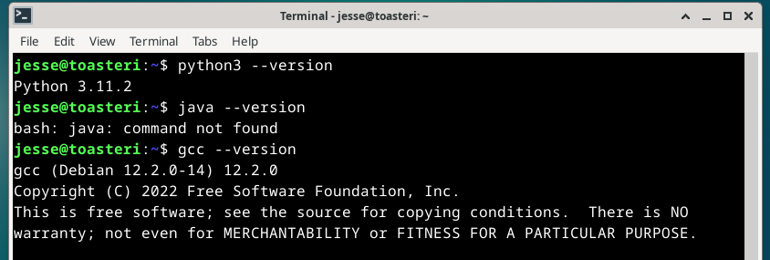
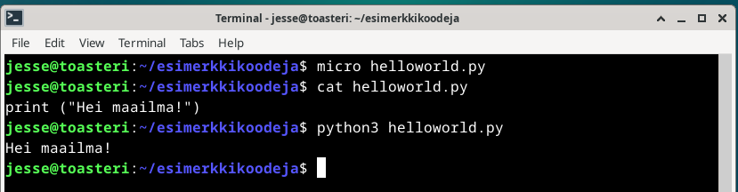
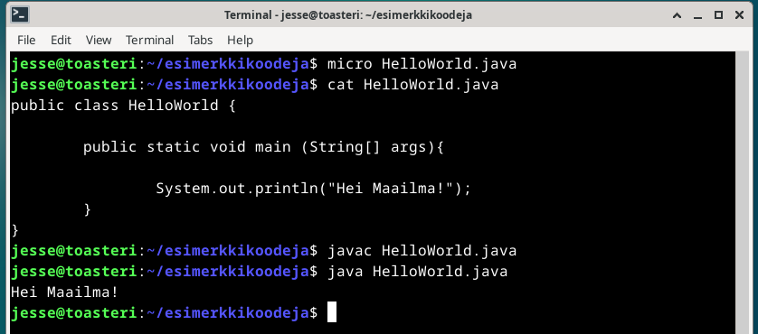
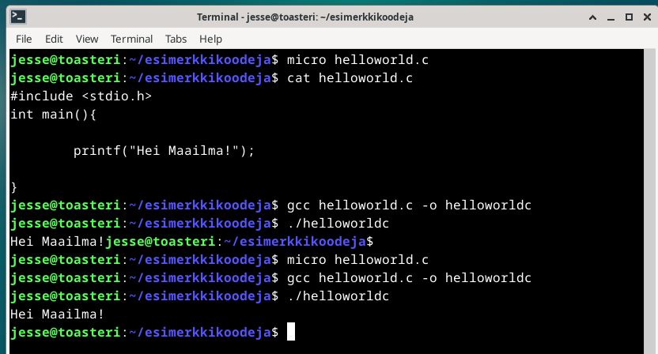
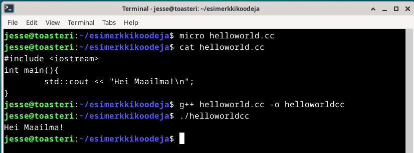
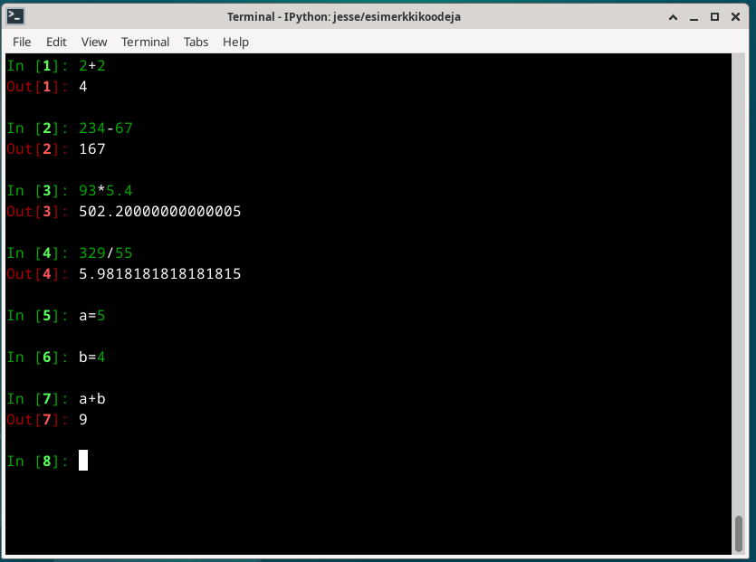
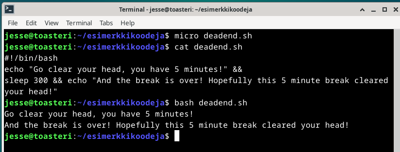
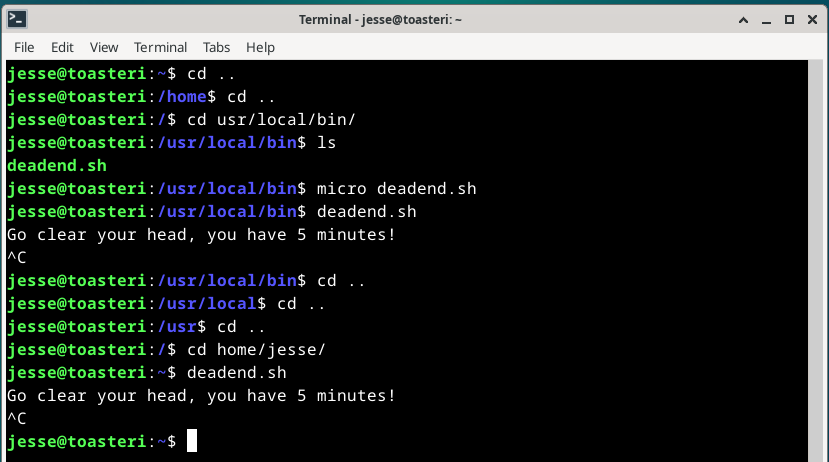

# h7 - Hello World

Viikon kotitehtävissä aiheena oli palvelimen sijaan ohjelmointi, sekä ensi viikon labraharkkaan valmistautuminen. Viikon aihetta ohjelmoinnin osalta voisi esimerkiksi käyttää hyödyksi aiemman weppipalvelimen kanssa, lisäämällä omalle sivulle jonkin yksinkertaisen ohjelman. Viikon aihe sinällään oli mielenkiintoinen, sillä pääaineena opiskelen ohjelmistokehitystä. Viikon tehtävissä muun muassa kääntää "Hei maailma" muutamalla eri ohjelmointikielellä, luoda uusia komentoja Linuxiin eri tavoin, sekä valmistautua ensi viikon labraharjoitukseen ratkaisemalla aikaisempien kurssien harjoitus. Tehtävien tarkemmat kuvaukset Opettajan [sivuilta](https://terokarvinen.com/2023/linux-palvelimet-2023-alkusyksy/#h7-hello-world)

## x) Kaikki tähän asti

## y) Lue ja tiivistä

Tiivistettävä artikkeli oli kurssin opettajan, Tero Karvisen kirjoittama [Hello World](https://terokarvinen.com/2018/hello-python3-bash-c-c-go-lua-ruby-java-programming-languages-on-ubuntu-18-04/) -artikkeli. Artikkelissa opastettiin kuinka Hello World -ohjelma kirjoitetaan ja käännetään useammalla eri kielellä. Artikkelissa opastetut kielet olivat:
- Python 3
- Bash
- C
- C++
- Java
- Go
- Ruby
- Lua

Artikkelissa mainitaankin, että Hello World -ohjelmalla aloitetaan uudella kielellä ohjelmointi. Sen lisäksi, että ohjelma on lyhyt ja yksinkertainen, sillä todennetaan uuden ohjelmointiympäristön toimivuus.

## a) Kolmella kielellä Hello World

### Käyttämäni työympäristö

Harjoitus tehtiin kannettavalla tietokoneellani, Lenovo Yoga Slim 7 Pro:lla (AMD Ryzen 7 5800H @ 3.20 GHz, 16 GB DDR4-3200, NVIDIA GeForce RTX 3050 laptop 4 GB GDDR6). Kannettavan käyttöjärjestälmänä oli WIN11, versio 22H2.

Virtuaalikoneena käytin Oraclen VM Virtual Box v7.0.10.

Virtuaalikoneella pyöritettävä käyttöjärjestelmä oli Linux Debian 12.1 xfce työpöytäympäristöllä.

$ sudo apt-get update ja upgrade oli suoritettu ennen tehtävien aloitusta.

### Tehtävä

Tehtävässä tuli kääntää "Hei Maailma" Pythonilla, Javalla ja C:llä. Ennen tehtävää tarkistin onko minulla kaikki tarvittavat paketit asennettuna komennoilla ``$ python3 --version``, ``$ java --version`` ja ``$ gcc --version``. Python 3 ja gcc palautti versionumeron, kun taas java ilmoitti "command not found". Asensin Javan tunnilla esitetyllä komennolla ``$ sudo apt-get install openjdk-17-jdk``. Tämän jälkeen myös versiotarkistus palautti javankin kohdalla versionumeron.

Aloitin tehtävän kirjoittamalla helloworld-ohjelman Pythonilla. Loin aluksi uuden esimerkkikoodeja-kansion kotihakemistooni, koska ainakin jossain määrin pidän asioiden järjestyksestä. Siirryin esimerkkikoodeja-kansioon, johon loin microlla uuden helloworld.py-tiedoston. Koodiin otin mallia lukutehtävän artikkelista, ja kirjoitettua pari riviä tallensin tiedoston. Tarkistin tiedoston sisällön lukemalla tiedoston cat-komennolla, jonka jälkeen ajoin komennon ``$ python3 helloworld.py``-komennolla.

Seuraavaksi kirjoitin saman helloworld-ohjelman Javalla. Loin esimerkkikoodeja-kansioon microlla HelloWorld.java-tiedoston, ja koodailtuani ohjelman tarkistin jälleen cat-komennolla mitä tiedostossa luki. Käänsin tiedoston Java-kääntäjällä (javac), jonka jälkeen ajoin ohjelman komennolla ``$ java HelloWorld.java``.

Kolmantena koodasin helloworld-ohjelman C-kielellä. Luotuani microlla haluamani ohjelman, käänsin ohjelman GCC:llä käyttäen "-o"-flagia. ``gcc --help``-komennolla selvitin, että "-o"-flagilla tuotetaan valitusta tiedostosta ohjelma, "Place the output into <file>." Lopuksi ajoin vielä ohjelman komennolla ``./helloworldc``.

## b) Hello World Encore

Tehtävässä tuli vielä kirjoittaa helloworld-ohjelma yhdellä vapaavalintaisella kielellä. Valitsin kieleksi C++, sillä siihen liittyy omia mielenkiinnon kohteita. Kuten aikaisemmissa helloworld-ohjelmissa, loin microlla helloworld.cc -tiedoston, jonka käänsin ``g++``-komennolla.

## c) Python taskulaskimena

Asensin tehtävää varten Jupyterin, eli komentokehotteen ipython3-käyttöliittymän komennolla ``$ sudo apt-get install ipython3``. Pythonia voi käyttää interaktiivisena taskulaskimena käynnistämällä joko Pythonin interaktiivisen ympäristön tai tapauksessani Jupyterin. Käynnistin Jupyterin ``$ ipython3``-komennolla, jonka jälkeen pystyin laskemaan eri laskutoimituksia komentokehotteella pyörivällä Jupyterillä. Laskimen avulla pystyi myös kääntämään lukuja binääreiksi tai heksadesimaaleiksi ja päin vastoin, mutta kuvassa tulin esitelleeksi vain maltillisesti hyvin yksinkertaisia laskutoimituksia.

## d) Shell-script

Tehtävässä tuli luoda uusi Shell-skripti. Shell-skripti on tiedosto, joka sisältää eri komentoja järjestyksessä. Kun kyseisen skripti-tiedoston suorittaa, komentokehote tekee tiedostossa olevat komennot järjestyksessään. Skripteillä onkin siis helppo toteuttaa erilaisia prosesseja vaivattomammin.

Tehtävä mukaili hyvin paljon helloworld-ohjelmien tekemistä. Tein aluksi microlla .sh-päätteisen tiedoston. Tarkistin tämän jälkeen ``cat``-komennolla mitä juuri skriptaamassani tiedostossa luki. Kaikki näytti hyvältä, niin ajoin skriptini ``$ bash deadend.sh``-komennolla. Nyt itselläni oli viiden minuutin hengähdystauko skriptattuna.

## e) Uusi komento Linuxiin

Tehtävänantona oli luoda Linuxiin uusi komento ja osoittaa, että se toimii kaikilla käyttäjillä ilman, että ohjelmaan tarvitsisi syöttää polku eteen. Jatkoin edellisen tehtävän deadend-taukolaskurin muokkaamista tehtävänannon mukaiseksi. Aloitin muokkaamalla aikaisempaa scriptiä vaihtamalla ensimmäisellä rivillä olevaa tulkin polkua.

    #!/bin/bash -> #!/usr/bin/bash

Seuraavaksi muokkasin tiedoston käyttöoikeuksia komennolla ``$ chmod ugo+rx deadend.sh``. Komento lisäsi luku- ja käyttöoikeuden muillekin kuin tiedoston tekijälle. Oikeuksien jälkeen siirsin tiedoston ``$ sudo mv deadend.sh /usr/local/bin/`` -komennolla uuteen hakemistoon. Kokeilin ajaa skriptiä, mutta komentokehote ilmoitti virheeksi ``bash: /usr/local/bin/deadend.sh: cannot execute: required file not found``. Siirryin usr/local/bin/ -hakemistoon, jossa deadend.sh -tiedosto löytyi. Avattuani tiedoston, huomasin virheen. ``#!usr/bin/bash`` rivistä puuttui ensimmäinen polkua merkkaava /-merkki. Pienen typon korjaaminen auttoi, ja nyt skriptiä pystyi ajamaan omasta kotihakemistosta.

## f) Intelligent intelligence

## g) Virtuaalikone labraharkkaan

## h) Uusi komento Linuxiin Pythonilla - Vapaaehtoinen

## i) Uusi komento Linuxiin Javalla - Vapaaehtoinen

## j) Uusi komento Linuxiin jollain muulla kielellä - Vapaa ehtoinen

## Lähteet

Tero Karvinen
- https://terokarvinen.com/2023/linux-palvelimet-2023-alkusyksy/#h7-hello-world
- https://terokarvinen.com/2018/hello-python3-bash-c-c-go-lua-ruby-java-programming-languages-on-ubuntu-18-04/
